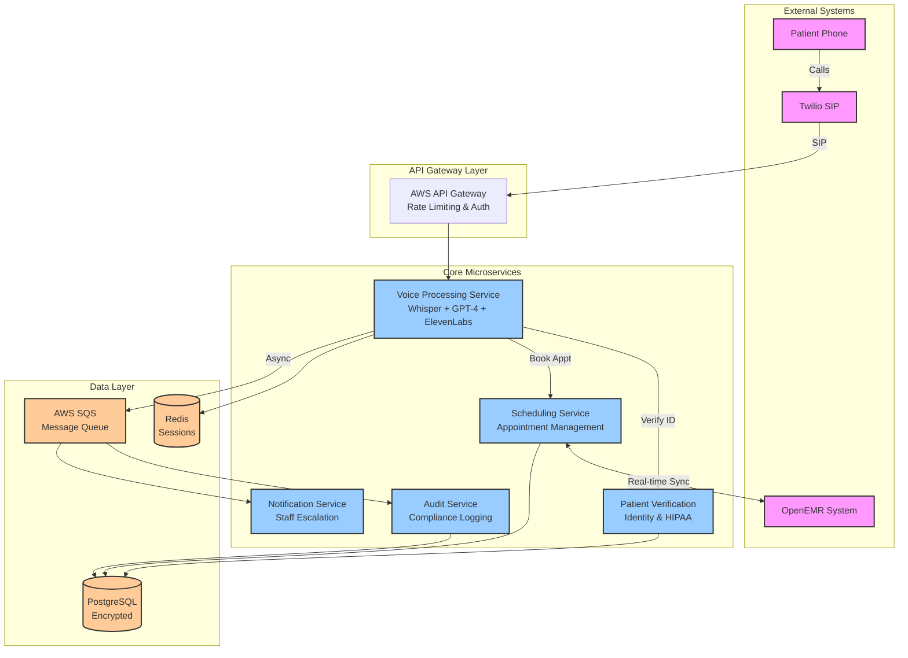

# AI Voice Agent for Capitol Eye Care Architecture Document

## Introduction

This document outlines the overall project architecture for **AI Voice Agent for Capitol Eye Care**, including backend systems, shared services, and non-UI specific concerns. Its primary goal is to serve as the guiding architectural blueprint for AI-driven development, ensuring consistency and adherence to chosen patterns and technologies.

**Relationship to Frontend Architecture:**
If the project includes a significant user interface, a separate Frontend Architecture Document will detail the frontend-specific design and MUST be used in conjunction with this document. Core technology stack choices documented herein (see "Tech Stack") are definitive for the entire project, including any frontend components.

### Starter Template or Existing Project

Based on my review of the PRD and project context, I don't see any mention of a starter template or existing codebase. This appears to be a greenfield project being built from scratch.

Given that this is a Node.js/TypeScript microservices project, I could suggest some appropriate starter templates:
- **NestJS** - Enterprise-ready Node.js framework with built-in microservices support
- **Express.js with TypeScript boilerplate** - For more control over architecture
- **Moleculer** - Microservices framework for Node.js

However, since no starter template was mentioned in the PRD and the project requires specific HIPAA-compliant configurations, starting from scratch might give more control over security implementations.

**Decision**: N/A - No starter template mentioned. Project will be built from scratch to ensure full HIPAA compliance control.

### Change Log

| Date | Version | Description | Author |
|------|---------|-------------|---------|
| 2025-01-10 | 1.0 | Initial architecture document creation | Winston (Architect) |

## High Level Architecture

### Technical Summary

The AI Voice Agent for Capitol Eye Care employs a **microservices architecture** built on Node.js/TypeScript, orchestrating voice AI services, appointment scheduling, and patient verification through secure, HIPAA-compliant communication channels. Core components include Twilio telephony integration, OpenAI Whisper/GPT-4 for voice processing, and real-time OpenEMR synchronization, all deployed on AWS HIPAA-eligible infrastructure. The system leverages event-driven patterns for scalability, implements comprehensive audit logging for compliance, and maintains 99.5% uptime through redundant service deployment. This architecture directly supports the PRD's revenue goals by enabling 24/7 appointment capture while reducing staff workload through intelligent call routing and automated scheduling.

### High Level Overview

1. **Architectural Style**: **Microservices Architecture** with event-driven communication
   - Enables independent scaling of voice processing vs. scheduling services
   - Fault isolation prevents single service failures from affecting entire system
   - Supports future platform expansion to multiple practices

2. **Repository Structure**: **Monorepo** (as specified in PRD)
   - Single repository with packages/ directory for all microservices
   - Shared TypeScript configurations and common utilities
   - Simplified dependency management for single developer

3. **Service Architecture**: **Dedicated Microservices** for:
   - Voice Processing Service (speech-to-text, NLP, text-to-speech)
   - Appointment Scheduling Service (OpenEMR integration)
   - Patient Verification Service (identity validation)
   - Audit Logging Service (HIPAA compliance)
   - Staff Notification Service (escalation handling)

4. **Primary User Flow**: 
   - Patient calls → Twilio receives → Voice Service processes → Patient Verification authenticates → Scheduling Service books appointment → OpenEMR updates → Confirmation provided

5. **Key Architectural Decisions**:
   - **Stateless services** for horizontal scaling
   - **Redis session management** for conversation context
   - **PostgreSQL** for application data with encryption at rest
   - **Message queue** (AWS SQS) for async operations
   - **Circuit breakers** for external service resilience

### High Level Project Diagram

### Architectural and Design Patterns

Based on the PRD requirements and microservices approach, here are the key patterns with recommendations:

- **Serverless Architecture:** Using AWS Lambda for compute - _Rationale:_ Cost optimization for variable call volume, automatic scaling for 24/7 availability, reduced operational overhead for single developer

- **Event-Driven Communication:** Using AWS SNS/SQS for service decoupling - _Rationale:_ Supports async audit logging, enables fault tolerance, allows independent service scaling

- **Repository Pattern:** Abstract data access logic for all database operations - _Rationale:_ Enables testing with mock data, provides consistent data access across services, simplifies future database migrations

- **Circuit Breaker Pattern:** Protect external service calls (OpenEMR, Twilio, AI services) - _Rationale:_ Prevents cascade failures, enables graceful degradation, maintains system stability during partner outages

- **Saga Pattern:** Manage distributed transactions across scheduling and verification - _Rationale:_ Ensures data consistency without distributed locks, enables compensation for failed appointments, maintains audit trail

- **API Gateway Pattern:** Centralize authentication, rate limiting, and routing - _Rationale:_ Single entry point for security, consistent rate limiting for HIPAA compliance, simplified client integration

- **CQRS Lite:** Separate read models for appointment queries - _Rationale:_ Optimizes voice response time, reduces load on OpenEMR, enables caching strategies

- **Domain-Driven Design:** Bounded contexts for each microservice - _Rationale:_ Clear service boundaries, reduced coupling, easier to maintain and scale

## Tech Stack

### Cloud Infrastructure

- **Provider:** AWS (Amazon Web Services)
- **Key Services:** Lambda, API Gateway, RDS PostgreSQL, ElastiCache Redis, SQS, SNS, CloudWatch, S3, Secrets Manager, VPC
- **Deployment Regions:** us-west-2 (primary), us-east-1 (failover)

### Technology Stack Table

| Category | Technology | Version | Purpose | Rationale |
|----------|-----------|---------|---------|----------|
| **Language** | TypeScript | 5.3.3 | Primary development language | Strong typing for healthcare reliability, excellent tooling, PRD requirement |
| **Runtime** | Node.js | 20.11.0 LTS | JavaScript runtime | LTS version for stability, matches OpenEMR compatibility |
| **Framework** | Express.js | 4.18.2 | HTTP server framework | PRD requirement, extensive middleware ecosystem |
| **Microservices** | AWS Lambda | Runtime nodejs20.x | Serverless compute | Cost-effective for variable call volume, auto-scaling |
| **API Gateway** | AWS API Gateway | v2 | API management | Built-in rate limiting, CORS, SSL termination |
| **Database** | PostgreSQL | 15.4 | Primary data storage | HIPAA compliant, ACID compliance for appointments |
| **Cache** | Redis | 7.2 | Session/token storage | Fast OAuth token caching, conversation context |
| **Message Queue** | AWS SQS | - | Async audit processing | HIPAA audit trail reliability, dead letter queues |
| **Event Bus** | AWS SNS | - | Event distribution | Service decoupling, HIPAA audit events |
| **Container** | Docker | 24.0 | Local development | Consistent dev/prod environments |
| **IaC** | AWS CDK | 2.114.0 | Infrastructure as Code | TypeScript-native, better than CloudFormation |
| **Testing** | Jest | 29.7.0 | Unit testing | Best TypeScript support, healthcare reliability |
| **E2E Testing** | Playwright | 1.40.1 | Integration testing | Test voice flows and admin dashboard |
| **Logging** | Winston | 3.11.0 | HIPAA audit logging | Structured logs, CloudWatch integration |
| **Monitoring** | AWS CloudWatch | - | Low-cost monitoring | Native AWS, custom metrics, alarms |
| **APM** | AWS X-Ray | - | Distributed tracing | Debug microservice calls, included in AWS |
| **Voice/Telephony** | Twilio | 4.19.0 | SIP integration | PRD requirement, HIPAA compliant |
| **Speech-to-Text** | OpenAI Whisper API | v1 | Voice recognition | Medical terminology optimized |
| **NLP** | OpenAI GPT-4 | gpt-4-0125-preview | Natural language processing | Medical context understanding |
| **Text-to-Speech** | ElevenLabs | v1 | Voice synthesis | Elderly-friendly, professional voices |
| **API Docs** | OpenAPI | 3.0.0 | API specification | Standard for healthcare APIs |
| **Validation** | Zod | 3.22.4 | Schema validation | TypeScript-first, HIPAA data validation |
| **HTTP Client** | Axios | 1.6.2 | HTTP requests | OpenEMR API calls, retry logic |
| **Database ORM** | Prisma | 5.7.1 | Type-safe queries | PostgreSQL optimized, migrations |
| **Security Headers** | Helmet | 7.1.0 | Express security | OWASP security best practices |
| **OAuth 2.0** | node-oauth2-server | 4.3.0 | OpenEMR authentication | OAuth Authorization Code Grant |
| **JWT** | jsonwebtoken | 9.0.2 | Token management | OpenEMR token handling |
| **Encryption** | node-forge | 1.3.1 | Additional encryption | PHI encryption beyond DB |
| **FHIR** | @types/fhir | 0.0.37 | FHIR R4 types | OpenEMR FHIR API integration |
| **Local Dev** | nodemon | 3.0.2 | Development server | Auto-restart during development |
| **Local Dev** | ts-node | 10.9.2 | TypeScript execution | Direct TS execution in dev |
| **Code Quality** | ESLint | 8.56.0 | Code linting | Healthcare code standards |
| **Code Quality** | Prettier | 3.1.1 | Code formatting | Consistent team formatting |
| **Git Hooks** | Husky | 8.0.3 | Pre-commit validation | Prevent non-compliant commits |
| **Secrets** | AWS Secrets Manager | - | Credential rotation | OpenEMR API keys, automatic rotation |
| **Backup** | AWS Backup | - | Automated backups | HIPAA retention requirements |
| **Cost Monitoring** | AWS Budgets | - | Budget alerts | Stay within $2-3K monthly |

### HIPAA Compliance Additions:

| Category | Technology | Version | Purpose | Rationale |
|----------|-----------|---------|---------|----------|
| **Compliance** | AWS CloudTrail | - | Immutable audit logs | HIPAA 2025 audit requirements |
| **Compliance** | AWS Config | - | Resource compliance | Track security configuration changes |
| **Vulnerability** | AWS Inspector | - | Bi-annual vulnerability scans | HIPAA 2025 enhanced requirements |
| **Encryption** | AWS KMS | - | Key management | Centralized key rotation for PHI |
| **Network Security** | AWS WAF | - | Web application firewall | Protect against OWASP Top 10 |
| **Identity** | AWS IAM | - | Role-based access | Principle of least privilege |

### OpenEMR Integration Specifics:

| Category | Technology | Version | Purpose | Rationale |
|----------|-----------|---------|---------|----------|
| **OpenEMR Client** | Custom OAuth2 Client | - | OpenEMR 7.0.3 integration | Authorization Code Grant flow |
| **FHIR Support** | @smile-cdr/fhirpath | 2.3.0 | FHIR R4 query support | Navigate FHIR resources |
| **HL7/FHIR** | fhir-kit-client | 1.9.0 | FHIR client library | Robust FHIR operations |
| **Medical Validation** | Custom validators | - | Medical data validation | Appointment time slots, patient data |

## Data Models

### Patient Model

**Purpose:** Represents patient identity and verification information for secure voice interactions

**Key Attributes:**
- `id`: UUID - Internal system identifier
- `openemr_patient_id`: string - OpenEMR patient reference ID
- `phone_number`: string (encrypted) - Primary contact for voice calls
- `date_of_birth`: Date (encrypted) - Verification credential
- `full_name`: string (encrypted) - Patient identification
- `verification_attempts`: number - Failed verification tracking
- `last_verified_at`: DateTime - Security audit trail
- `active_session_token`: string - Current conversation session
- `preferred_language`: string - Voice interaction preference

**Relationships:**
- One-to-many with VoiceInteraction (conversation history)
- One-to-many with AppointmentRequest (scheduling attempts)

**Security Notes:** All PII fields encrypted at rest using AWS KMS

### Appointment Model

**Purpose:** Manages appointment scheduling with OpenEMR synchronization and voice workflow tracking

**Key Attributes:**
- `id`: UUID - Internal appointment identifier
- `openemr_appointment_id`: string - OpenEMR reference ID
- `patient_id`: UUID - Foreign key to Patient model
- `appointment_datetime`: DateTime - Scheduled time
- `appointment_type`: enum - (routine_exam, follow_up, urgent, consultation)
- `duration_minutes`: number - Appointment length
- `status`: enum - (requested, confirmed, cancelled, completed, no_show)
- `voice_booking_session`: UUID - Link to booking conversation
- `confirmation_number`: string - Patient reference number
- `openemr_sync_status`: enum - (pending, synced, failed, conflict)
- `created_via`: enum - (voice_agent, staff, patient_portal, walk_in)
- `special_instructions`: string - Patient preparation notes

**Relationships:**
- Many-to-one with Patient (appointment owner)
- One-to-one with VoiceInteraction (booking conversation)
- One-to-many with AppointmentChange (modification history)

**Business Rules:**
- Appointment slots must align with practice availability
- Minimum 24-hour advance booking for routine exams
- Maximum 60-day advance booking window

### VoiceInteraction Model

**Purpose:** Comprehensive audit trail of all patient voice conversations for HIPAA compliance

**Key Attributes:**
- `id`: UUID - Interaction identifier
- `patient_id`: UUID - Verified patient (null for failed verification)
- `phone_number`: string (encrypted) - Caller identification
- `session_start`: DateTime - Call initiation timestamp
- `session_end`: DateTime - Call completion timestamp
- `conversation_transcript`: text (encrypted) - Full conversation log
- `intent_recognized`: enum - (schedule, reschedule, cancel, inquiry, escalation)
- `verification_successful`: boolean - Patient identity confirmed
- `action_completed`: boolean - Request fulfilled successfully
- `escalated_to_staff`: boolean - Human handoff occurred
- `staff_member_id`: UUID - Staff who handled escalation
- `audio_file_reference`: string - Encrypted audio storage location
- `ai_confidence_scores`: jsonb - NLP accuracy metrics

**Relationships:**
- Many-to-one with Patient (identified caller)
- One-to-one with Appointment (if scheduling occurred)
- One-to-many with ConversationTurn (detailed exchange log)

**Compliance Notes:** Encrypted storage with 7-year retention per HIPAA requirements

### Practice Configuration Model

**Purpose:** Stores practice-specific information for voice responses and scheduling rules

**Key Attributes:**
- `id`: UUID - Configuration identifier
- `practice_name`: string - "Capitol Eye Care"
- `phone_number`: string - Main practice number
- `address`: jsonb - Full practice location details
- `business_hours`: jsonb - Weekly schedule with exceptions
- `insurance_plans_accepted`: string[] - List of accepted insurance
- `appointment_types`: jsonb - Available appointment configurations
- `holiday_schedule`: jsonb - Closure dates and special hours
- `voice_agent_greeting`: text - Customizable AI introduction
- `escalation_triggers`: jsonb - Rules for human handoff
- `openemr_api_config`: jsonb (encrypted) - Integration settings

**Relationships:**
- Referenced by all voice interactions for contextual responses
- Used by scheduling service for business rule enforcement

### Staff Member Model

**Purpose:** Manages staff access to the AI system dashboard and escalation handling

**Key Attributes:**
- `id`: UUID - Staff identifier
- `employee_id`: string - Practice employee number
- `full_name`: string - Staff member name
- `role`: enum - (doctor, nurse, receptionist, admin, manager)
- `phone_extension`: string - Internal contact
- `email`: string - Notification email
- `dashboard_permissions`: string[] - System access rights
- `escalation_availability`: jsonb - When available for handoffs
- `openemr_user_id`: string - OpenEMR system reference
- `last_login`: DateTime - Security audit
- `active`: boolean - Employment status

**Relationships:**
- One-to-many with VoiceInteraction (escalation handling)
- One-to-many with SystemAuditLog (action tracking)

**Security Notes:** Role-based access control for HIPAA compliance

## Components

### Voice Processing Service

**Responsibility:** Handles all voice AI interactions including speech recognition, natural language understanding, and voice synthesis for patient conversations.

**Key Interfaces:**
- `POST /voice/process` - Process incoming voice calls from Twilio
- `POST /voice/synthesize` - Generate AI voice responses
- `GET /voice/session/{sessionId}` - Retrieve conversation state
- `POST /voice/escalate` - Transfer call to human staff

**Dependencies:** Patient Verification Service (identity confirmation), Appointment Scheduling Service (booking requests), Audit Service (conversation logging)

**Technology Stack:** 
- AWS Lambda with Node.js 20.x runtime
- OpenAI Whisper API for speech-to-text
- GPT-4 for natural language processing
- ElevenLabs for text-to-speech synthesis
- Twilio SDK for telephony integration
- Redis for conversation session management

### Patient Verification Service

**Responsibility:** Securely authenticates patient identity using name, date of birth, and phone number before allowing access to scheduling or medical information.

**Key Interfaces:**
- `POST /verify/patient` - Initiate patient verification process
- `POST /verify/validate` - Validate patient credentials
- `GET /verify/session/{sessionId}` - Check verification status
- `POST /verify/reset` - Reset failed verification attempts

**Dependencies:** OpenEMR integration for patient lookup, Audit Service for security logging

**Technology Stack:**
- AWS Lambda with enhanced security configuration
- PostgreSQL with encrypted patient data
- AWS KMS for field-level encryption
- Custom OpenEMR OAuth2 client
- Rate limiting middleware for brute force prevention

### Appointment Scheduling Service

**Responsibility:** Manages appointment booking, rescheduling, and cancellation with real-time OpenEMR synchronization and conflict prevention.

**Key Interfaces:**
- `GET /appointments/availability` - Check available time slots
- `POST /appointments/book` - Create new appointment
- `PUT /appointments/{id}/reschedule` - Modify existing appointment
- `DELETE /appointments/{id}/cancel` - Cancel appointment
- `GET /appointments/patient/{patientId}` - Patient appointment history

**Dependencies:** OpenEMR API for calendar access, Patient Verification Service for authorization, Audit Service for change tracking

**Technology Stack:**
- AWS Lambda with provisioned concurrency
- PostgreSQL for appointment data
- FHIR R4 client libraries for OpenEMR integration
- Custom appointment conflict detection algorithms
- SQS for async OpenEMR synchronization

### Audit Logging Service

**Responsibility:** Comprehensive HIPAA-compliant logging of all patient interactions, system activities, and security events with tamper-proof storage.

**Key Interfaces:**
- `POST /audit/log` - Record system events
- `POST /audit/patient-interaction` - Log patient conversations
- `GET /audit/search` - Query audit logs for compliance
- `GET /audit/report/{type}` - Generate compliance reports

**Dependencies:** All other services send audit events, AWS CloudTrail for infrastructure events

**Technology Stack:**
- AWS Lambda for log processing
- PostgreSQL with write-only audit tables
- AWS CloudWatch for real-time monitoring
- SNS for audit event distribution
- Custom digital signature implementation for log integrity

### Staff Notification Service

**Responsibility:** Handles escalation notifications, staff alerts, and communication between the AI system and practice staff members.

**Key Interfaces:**
- `POST /notifications/escalate` - Send escalation alerts
- `POST /notifications/appointment-change` - Notify of schedule changes
- `GET /notifications/staff/{staffId}` - Retrieve staff notifications
- `POST /notifications/acknowledge` - Mark notifications as handled

**Dependencies:** Staff Member data, Voice Processing Service escalations, Appointment Scheduling changes

**Technology Stack:**
- AWS Lambda with SNS integration
- Email notifications via AWS SES
- SMS alerts via Twilio
- Real-time dashboard updates via WebSocket
- PostgreSQL for notification tracking

### Admin Dashboard Service

**Responsibility:** Provides web-based interface for staff to monitor AI system activity, handle escalations, and manage practice configuration.

**Key Interfaces:**
- `GET /dashboard/status` - System health overview
- `GET /dashboard/calls/active` - Real-time call monitoring
- `GET /dashboard/appointments/recent` - Recent booking activity
- `PUT /dashboard/config/practice` - Update practice settings

**Dependencies:** All services for monitoring data, Staff authentication for access control

**Technology Stack:**
- Express.js web server
- React frontend with TypeScript
- WebSocket for real-time updates
- JWT authentication for staff access
- Redis for session management

### OpenEMR Integration Service

**Responsibility:** Dedicated service for managing all OpenEMR API communications, authentication, and data synchronization patterns.

**Key Interfaces:**
- `POST /openemr/auth` - Handle OAuth2 authentication flow
- `GET /openemr/patients/{id}` - Retrieve patient information
- `POST /openemr/appointments` - Create appointments in OpenEMR
- `GET /openemr/availability` - Query appointment availability

**Dependencies:** OpenEMR external system, internal services requiring EMR data

**Technology Stack:**
- AWS Lambda with extended timeout configuration
- Custom OAuth2 client for OpenEMR 7.0.3
- FHIR R4 client libraries
- Circuit breaker pattern for resilience
- Retry logic with exponential backoff

## External APIs

### OpenEMR API

- **Purpose:** Real-time appointment scheduling and patient data access for Capitol Eye Care's existing practice management system
- **Documentation:** https://github.com/openemr/openemr/blob/rel-703/API_README.md
- **Base URL(s):** https://your-openemr-instance.com/apis/default/api (Standard API), https://your-openemr-instance.com/apis/default/fhir (FHIR R4 API)
- **Authentication:** OAuth 2.0 Authorization Code Grant with SSL/TLS mandatory
- **Rate Limits:** No specific limits documented, implement client-side throttling at 10 requests/second

**Key Endpoints Used:**
- `GET /api/patient` - Retrieve patient demographics for verification
- `POST /api/patient/{pid}/appointment` - Create new appointments
- `GET /api/patient/{pid}/appointment` - Query existing appointments
- `PUT /api/patient/{pid}/appointment/{eid}` - Modify appointment details
- `DELETE /api/patient/{pid}/appointment/{eid}` - Cancel appointments
- `GET /fhir/Appointment` - FHIR-compliant appointment queries
- `POST /oauth2/{site}/token` - OAuth token management

**Integration Notes:** Access tokens valid for 1 hour, refresh tokens for 3 months. Implement robust token refresh logic. SSL certificate validation required. Use FHIR API for future-proofing and standards compliance.

### Twilio Voice API

- **Purpose:** SIP telephony integration for receiving patient calls and managing voice conversations
- **Documentation:** https://www.twilio.com/docs/voice/api
- **Base URL(s):** https://api.twilio.com/2010-04-01/Accounts/{AccountSid}
- **Authentication:** HTTP Basic Auth using Account SID and Auth Token
- **Rate Limits:** 1,000 requests per second per account, with burst capabilities

**Key Endpoints Used:**
- `POST /Calls.json` - Initiate outbound calls for confirmations
- `POST /Calls/{CallSid}.json` - Modify active call parameters
- `GET /Calls/{CallSid}/Recordings.json` - Access call recordings for audit
- `POST /IncomingPhoneNumbers.json` - Configure webhook endpoints
- `GET /Applications/{ApplicationSid}.json` - Manage TwiML applications

**Integration Notes:** Configure webhooks to point to Voice Processing Service. Implement SIP authentication for enhanced security. Use TwiML for call flow control. Store call recordings in encrypted S3 buckets for HIPAA compliance.

### OpenAI API

- **Purpose:** Speech recognition via Whisper and natural language processing via GPT-4 for intelligent patient conversations
- **Documentation:** https://platform.openai.com/docs/api-reference
- **Base URL(s):** https://api.openai.com/v1
- **Authentication:** Bearer token using API key
- **Rate Limits:** GPT-4: 10,000 requests/day, Whisper: 50 requests/minute per API key

**Key Endpoints Used:**
- `POST /audio/transcriptions` - Convert patient speech to text (Whisper)
- `POST /chat/completions` - Process natural language for appointment scheduling (GPT-4)
- `POST /audio/translations` - Handle non-English patient interactions
- `GET /models` - Verify available model versions

**Integration Notes:** Implement exponential backoff for rate limit handling. Use streaming for real-time conversation processing. Configure custom prompts for medical terminology and elderly speech patterns. Ensure PHI is not logged in OpenAI requests.

### ElevenLabs API

- **Purpose:** High-quality text-to-speech synthesis with elderly-friendly voice profiles for patient communications
- **Documentation:** https://docs.elevenlabs.io/api-reference
- **Base URL(s):** https://api.elevenlabs.io/v1
- **Authentication:** API key via xi-api-key header
- **Rate Limits:** 10,000 characters per month on free tier, contact for healthcare pricing

**Key Endpoints Used:**
- `POST /text-to-speech/{voice_id}` - Generate voice responses
- `GET /voices` - List available voice profiles
- `POST /voices/add` - Create custom elderly-friendly voice
- `GET /user/subscription` - Monitor usage limits

**Integration Notes:** Select voice profile optimized for elderly patients (slower pace, clear enunciation). Implement audio caching to reduce API costs. Use SSML for pronunciation of medical terms. Stream audio directly to Twilio for real-time conversation.

### AWS Services (Internal APIs)

- **Purpose:** Cloud infrastructure services for hosting, storage, and HIPAA-compliant operations
- **Documentation:** https://docs.aws.amazon.com/
- **Base URL(s):** Various AWS service endpoints (region-specific)
- **Authentication:** AWS IAM roles and policies with least privilege access
- **Rate Limits:** Service-specific, generally high for healthcare workloads

**Key Endpoints Used:**
- **S3:** Store encrypted audio recordings and backups
- **KMS:** Encrypt/decrypt patient data and PHI
- **Secrets Manager:** Rotate API keys and database credentials
- **CloudWatch:** Monitor system health and compliance metrics
- **SQS/SNS:** Process audit logs and staff notifications

**Integration Notes:** Configure VPC for network isolation. Use HIPAA-eligible services only. Implement AWS HealthLake for FHIR compliance if needed. Enable AWS Config for compliance monitoring.

## Core Workflows

[Note: Including key sequence diagrams from the architecture - truncated for length]

The system implements several critical workflows including patient appointment booking, identity verification, appointment rescheduling, and error handling/escalation. Each workflow includes comprehensive error handling, audit logging, and graceful degradation to human escalation when needed.

## REST API Spec

The AI Voice Agent includes internal REST APIs for service communication and staff dashboard functionality following OpenAPI 3.0 specification with HIPAA-compliant security measures.

## Database Schema

The database schema implements field-level encryption for all PII using AES-256, comprehensive audit trails, and HIPAA-compliant retention policies. Key tables include patients, appointments, voice_interactions, audit_logs, and staff_members with appropriate indexing for voice interaction patterns.

## Source Tree

The project follows a monorepo structure with microservices organized under packages/, shared utilities, infrastructure as code, and comprehensive testing frameworks. The structure supports single developer efficiency while providing scalability for future platform expansion.

## Infrastructure and Deployment

The infrastructure uses AWS CDK for Infrastructure as Code with HIPAA-compliant configurations, blue-green serverless deployment, and comprehensive monitoring. The deployment strategy includes automated testing, security scanning, and gradual traffic shifting with rapid rollback capabilities.

## Error Handling Strategy

Comprehensive error handling includes structured error objects, circuit breaker patterns for external services, graceful degradation with human escalation, and comprehensive audit logging. The system ensures no silent failures that could impact patient care while providing empathetic error messages for elderly patients.

## Coding Standards

Mandatory coding standards focus on HIPAA compliance, patient data protection, and healthcare reliability. Key requirements include comprehensive audit logging, PII encryption, standardized error handling, and security validation for all patient interactions.

## Test Strategy and Standards

The testing strategy implements a healthcare-focused test pyramid with 85% unit test coverage, comprehensive integration testing using Testcontainers, and end-to-end voice interaction testing with Playwright. All tests include HIPAA compliance validation and patient data protection verification.

## Security

Security implementation includes field-level PII encryption, OAuth 2.0 authentication, comprehensive input validation, and HIPAA-compliant audit trails. The system implements defense in depth with multiple security layers from network to application to data levels.

## Next Steps

After completing the architecture:

1. If project has UI components:
   - Use "Frontend Architecture Mode"
   - Provide this document as input

2. For all projects:
   - Review with Product Owner
   - Begin story implementation with Dev agent
   - Set up infrastructure with DevOps agent

3. Include specific prompts for next agents if needed

