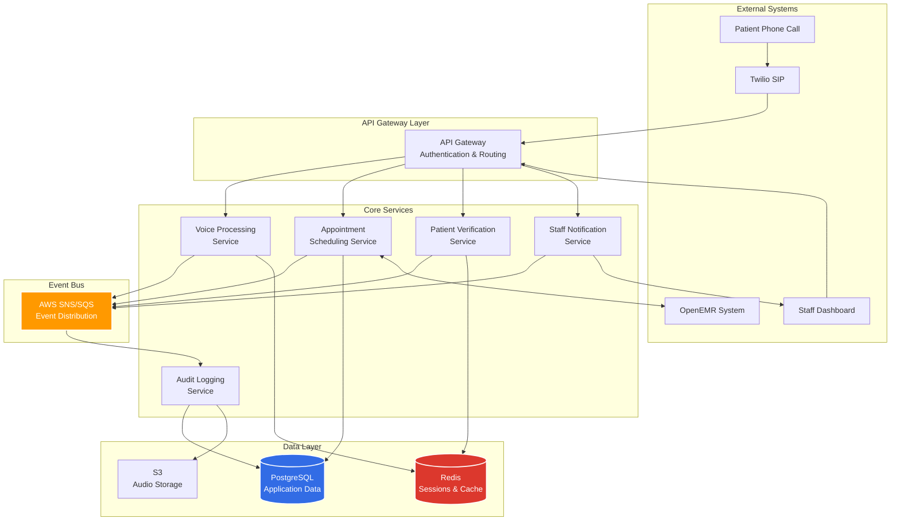

# AI Voice Agent for Capitol Eye Care Architecture Document

## Introduction

This document outlines the overall project architecture for **AI Voice Agent for Capitol Eye Care**, including backend systems, shared services, and non-UI specific concerns. Its primary goal is to serve as the guiding architectural blueprint for AI-driven development, ensuring consistency and adherence to chosen patterns and technologies.

**Relationship to Frontend Architecture:**
If the project includes a significant user interface, a separate Frontend Architecture Document will detail the frontend-specific design and MUST be used in conjunction with this document. Core technology stack choices documented herein (see "Tech Stack") are definitive for the entire project, including any frontend components.

### Starter Template or Existing Project

**Decision:** This is a greenfield project with no starter template mentioned. Given the specialized healthcare requirements and microservices architecture, we'll design the architecture from scratch to ensure HIPAA compliance and proper service isolation.

Since no starter template is specified, I recommend considering:
- **For Node.js microservices:** Using a lightweight Express.js setup with TypeScript
- **For monorepo management:** Lerna or Yarn workspaces for package management
- **For service templates:** Creating custom service templates based on our architecture decisions

**Current Decision:** N/A - No starter template will be used. This is a greenfield implementation.

### Change Log
| Date | Version | Description | Author |
|------|---------|-------------|--------|
| 2025-01-09 | 1.0 | Initial architecture document creation | Architect Agent |

## High Level Architecture

### Technical Summary

The AI Voice Agent system employs a **microservices architecture** deployed on **AWS HIPAA-eligible infrastructure**, utilizing **Node.js/TypeScript** services that integrate with Capitol Eye Care's **OpenEMR** system. The architecture prioritizes **24/7 availability**, **HIPAA compliance**, and **elderly-friendly voice interactions** through specialized AI services including **OpenAI Whisper**, **GPT-4**, and **ElevenLabs TTS**. Core architectural patterns include **event-driven communication**, **API Gateway pattern**, and **secure service mesh** to ensure reliable, scalable, and compliant patient communication automation.

### High Level Overview

1. **Main Architectural Style:** Microservices Architecture
   - Enables independent scaling of voice processing vs scheduling services
   - Provides fault isolation for critical patient-facing operations
   - Supports the future platform business model for multi-practice deployment

2. **Repository Structure:** Monorepo (as specified in PRD)
   - Single repository with separate packages for each microservice
   - Shared utilities and types in common packages
   - Simplified dependency management and atomic commits

3. **Service Architecture:** Microservices with 5 core services:
   - **Voice Processing Service:** Speech-to-text, NLP, text-to-speech
   - **Appointment Scheduling Service:** OpenEMR integration and calendar management
   - **Patient Verification Service:** Identity validation and session management
   - **Audit Logging Service:** HIPAA compliance and interaction recording
   - **Staff Notification Service:** Escalation handling and real-time alerts

4. **Primary User Flow:**
   - Patient calls → Twilio receives → Routes to Voice Service → Verifies identity → Processes request → Integrates with OpenEMR → Confirms action → Logs interaction

5. **Key Architectural Decisions:**
   - **Async Communication:** Event-driven architecture using AWS SQS/SNS for service decoupling
   - **API Gateway:** Centralized entry point for all services with authentication
   - **Data Segregation:** Separate databases per service to ensure data isolation
   - **Session Management:** Redis for distributed session state across services

### High Level Project Diagram



### Architectural and Design Patterns

- **Microservices Architecture:** Separate services for voice, scheduling, verification, audit, and notifications - *Rationale:* Enables independent scaling, fault isolation, and supports future multi-practice platform model

- **Event-Driven Communication:** Using AWS SNS/SQS for async service communication - *Rationale:* Provides resilience, decoupling, and audit trail for all system events critical for HIPAA compliance

- **API Gateway Pattern:** Centralized entry point with authentication and routing - *Rationale:* Simplifies security implementation and provides single point for monitoring and rate limiting

- **Repository Pattern:** Abstract data access for each service - *Rationale:* Enables testing with mock data and future database migration flexibility

- **Circuit Breaker Pattern:** For OpenEMR and external API calls - *Rationale:* Prevents cascade failures when external systems are unavailable

- **CQRS for Audit Service:** Separate read/write models for audit logs - *Rationale:* Optimizes write performance for compliance logging while enabling complex audit queries

- **Saga Pattern:** For multi-service appointment booking transactions - *Rationale:* Ensures consistency across services without distributed transactions

## Tech Stack

### Cloud Infrastructure
- **Provider:** AWS
- **Key Services:** VPC, RDS (PostgreSQL), ElastiCache (Redis), SNS/SQS, S3, CloudWatch, Secrets Manager
- **Deployment Regions:** us-west-2 (primary), us-east-1 (DR consideration)

### Technology Stack Table

| Category | Technology | Version | Purpose | Rationale |
|----------|-----------|---------|---------|-----------|
| **Language** | TypeScript | 5.3.3 | Primary development language | Strong typing for healthcare reliability, excellent tooling, PRD requirement |
| **Runtime** | Node.js | 20.11.0 | JavaScript runtime | LTS version, stable performance, wide ecosystem support |
| **API Framework** | Express.js | 4.18.2 | HTTP server framework | PRD specified, mature, extensive middleware ecosystem |
| **Database** | PostgreSQL | 15.5 | Primary data storage | HIPAA compliance, ACID guarantees, JSON support for flexibility |
| **Cache/Sessions** | Redis | 7.2.4 | Session management & caching | PRD specified, excellent performance, distributed session support |
| **Message Queue** | AWS SQS | - | Async message processing | HIPAA eligible, serverless scaling, dead letter queue support |
| **Event Bus** | AWS SNS | - | Event distribution | HIPAA eligible, fan-out pattern support, reliable delivery |
| **Voice AI - STT** | OpenAI Whisper | Latest API | Speech-to-text | PRD specified, excellent accuracy, medical terminology support |
| **Voice AI - NLP** | GPT-4 | Latest API | Natural language processing | PRD specified, context understanding, medical domain capability |
| **Voice AI - TTS** | ElevenLabs | Latest API | Text-to-speech | PRD specified, natural voice quality, elderly-friendly options |
| **Telephony** | Twilio | Latest SDK | SIP integration | PRD specified, reliable, extensive telephony features |
| **Object Storage** | AWS S3 | - | Audio file storage | HIPAA eligible, lifecycle policies, encryption at rest |
| **Secrets Management** | AWS Secrets Manager | - | Credential storage | HIPAA eligible, automatic rotation, audit trail |
| **Monitoring** | CloudWatch | - | System monitoring | Native AWS integration, custom metrics, alerting |
| **Container Runtime** | Docker | 24.0.7 | Containerization | Consistent deployment, local development parity |
| **Orchestration** | ECS Fargate | - | Container orchestration | Serverless containers, HIPAA eligible, automatic scaling |
| **Load Balancer** | ALB | - | Traffic distribution | HIPAA eligible, health checks, SSL termination |
| **CDN/DDoS** | CloudFront | - | Static content & protection | Global distribution, DDoS protection, HIPAA eligible |
| **Test - Unit** | Jest | 29.7.0 | Unit testing | TypeScript support, excellent mocking, fast execution |
| **Test - Integration** | Supertest | 6.3.4 | API testing | Express.js integration, simple API testing |
| **Test - E2E** | Playwright | 1.41.2 | End-to-end testing | Modern, reliable, good debugging tools |
| **Linting** | ESLint | 8.56.0 | Code quality | TypeScript support, customizable rules, wide adoption |
| **Formatting** | Prettier | 3.2.4 | Code formatting | Consistent style, TypeScript support, ESLint integration |
| **Package Manager** | pnpm | 8.15.1 | Dependency management | Efficient storage, fast installs, monorepo support |
| **Monorepo Tool** | Turborepo | 1.11.3 | Monorepo management | Fast builds, intelligent caching, simple configuration |
| **API Documentation** | OpenAPI | 3.0.3 | API specification | Standard format, code generation, testing support |
| **Process Manager** | PM2 | 5.3.0 | Process management | Process monitoring, auto-restart, cluster mode |

## Data Models

### Patient Model

**Purpose:** Represents patient information synchronized from OpenEMR for verification and appointment management

**Key Attributes:**
- patientId: string (UUID) - Unique identifier from OpenEMR
- firstName: string - Patient's first name
- lastName: string - Patient's last name
- dateOfBirth: date - For identity verification
- phoneNumbers: string[] - Array of registered phone numbers
- email: string (optional) - Email for confirmations
- preferredLanguage: string - Language preference (default: 'en')
- lastVerifiedAt: timestamp - Last successful verification
- createdAt: timestamp - Record creation date
- updatedAt: timestamp - Last modification date

**Relationships:**
- Has many Appointments
- Has many InteractionLogs
- Has many VerificationAttempts

### Appointment Model

**Purpose:** Represents appointment data synchronized with OpenEMR, including bookings, modifications, and cancellations

**Key Attributes:**
- appointmentId: string (UUID) - Unique identifier
- openEmrAppointmentId: string - OpenEMR reference ID
- patientId: string (UUID) - Reference to Patient
- appointmentType: enum - ['routine_exam', 'follow_up', 'urgent', 'contact_lens_fitting']
- scheduledDateTime: timestamp - Appointment date/time
- durationMinutes: integer - Expected appointment duration
- status: enum - ['scheduled', 'confirmed', 'cancelled', 'completed', 'no_show']
- providerNotes: string (encrypted) - Special instructions
- confirmationNumber: string - Unique confirmation code
- createdAt: timestamp - Booking creation
- createdBy: enum - ['ai_agent', 'staff', 'patient_portal']
- lastModifiedAt: timestamp - Last change timestamp
- lastModifiedBy: string - Who made the last change

**Relationships:**
- Belongs to Patient
- Has many AppointmentChangeLogs
- Has one InteractionLog (booking interaction)

### InteractionLog Model

**Purpose:** Comprehensive audit trail of all patient interactions for HIPAA compliance and quality monitoring

**Key Attributes:**
- interactionId: string (UUID) - Unique identifier
- patientId: string (UUID) - Reference to Patient (nullable for unverified)
- sessionId: string (UUID) - Voice session identifier
- interactionType: enum - ['appointment_booking', 'appointment_change', 'general_inquiry', 'verification_attempt']
- startTime: timestamp - Interaction start
- endTime: timestamp - Interaction end
- durationSeconds: integer - Total duration
- transcriptUrl: string - S3 URL to encrypted transcript
- audioRecordingUrl: string - S3 URL to encrypted recording
- outcome: enum - ['successful', 'escalated', 'abandoned', 'failed']
- escalationReason: string - If escalated, why
- aiConfidenceScore: float - AI's confidence in handling
- createdAt: timestamp - Log creation

**Relationships:**
- Belongs to Patient (optional)
- Has many ConversationTurns
- May reference Appointment

## Components

### Voice Processing Service

**Responsibility:** Handles all voice-related operations including speech-to-text, natural language understanding, and text-to-speech conversion for patient interactions

**Key Interfaces:**
- POST `/voice/session/start` - Initiates new voice session with Twilio
- POST `/voice/process` - Processes audio chunks through Whisper API
- POST `/voice/respond` - Generates TTS response via ElevenLabs
- WebSocket `/voice/stream` - Real-time audio streaming

**Dependencies:** 
- Twilio SDK for telephony
- OpenAI Whisper API for STT
- GPT-4 API for NLU
- ElevenLabs API for TTS
- Redis for session state
- Event Bus for service communication

**Technology Stack:** Node.js/TypeScript, Express.js, WebSocket support, Redis client

### Appointment Scheduling Service

**Responsibility:** Manages all appointment operations including availability checking, booking, rescheduling, and cancellation with real-time OpenEMR synchronization

**Key Interfaces:**
- GET `/appointments/availability` - Query available time slots
- POST `/appointments/book` - Create new appointment
- PUT `/appointments/{id}/reschedule` - Modify existing appointment
- DELETE `/appointments/{id}` - Cancel appointment
- GET `/appointments/sync` - Force sync with OpenEMR

**Dependencies:**
- OpenEMR REST API for calendar operations
- PostgreSQL for local appointment cache
- Event Bus for notifications
- Patient Verification Service for identity validation

**Technology Stack:** Node.js/TypeScript, Express.js, OpenAPI client for OpenEMR, TypeORM for PostgreSQL

### Patient Verification Service

**Responsibility:** Handles secure patient identity verification using multiple factors and manages verification sessions throughout interactions

**Key Interfaces:**
- POST `/verify/patient` - Verify patient identity
- GET `/verify/session/{id}` - Check verification status
- POST `/verify/challenge` - Additional verification challenge
- DELETE `/verify/session/{id}` - Invalidate session

**Dependencies:**
- OpenEMR REST API for patient lookup
- Redis for verification session storage
- Audit Service for compliance logging
- Event Bus for verification events

**Technology Stack:** Node.js/TypeScript, Express.js, Redis client, bcrypt for secure comparison

## External APIs

### OpenEMR API

- **Purpose:** Real-time integration with Capitol Eye Care's practice management system for patient data and appointment scheduling
- **Documentation:** [Need to request from Capitol Eye Care IT or OpenEMR instance admin]
- **Base URL(s):** https://[practice-domain]/apis/default/api
- **Authentication:** OAuth 2.0 with client credentials flow
- **Rate Limits:** Typically 100 requests/minute (needs verification with instance)

**Key Endpoints Used:**
- `GET /api/patient` - Retrieve patient information for verification
- `GET /api/appointment` - Fetch appointment availability and details
- `POST /api/appointment` - Create new appointments
- `PUT /api/appointment/{id}` - Modify existing appointments
- `DELETE /api/appointment/{id}` - Cancel appointments
- `GET /api/facility` - Retrieve practice location and hours

**Integration Notes:** Must handle OpenEMR's specific date/time formats, implement retry logic for reliability, and cache frequently accessed data like facility info to reduce API calls.

### Twilio Voice API

- **Purpose:** Telephony integration for receiving patient calls and managing voice sessions
- **Documentation:** https://www.twilio.com/docs/voice
- **Base URL(s):** https://api.twilio.com/2010-04-01
- **Authentication:** HTTP Basic Auth with Account SID and Auth Token
- **Rate Limits:** 1000 requests/second per account

**Key Endpoints Used:**
- `POST /Accounts/{AccountSid}/Calls` - Initiate outbound calls
- `POST /Accounts/{AccountSid}/Calls/{CallSid}` - Update call state
- TwiML webhooks for inbound call handling
- Media Streams API for real-time audio streaming

**Integration Notes:** Implement TwiML responses for call flow control, use Twilio's SIP interface for practice phone integration, implement proper error handling for call failures.

## Database Schema

```sql
-- Enable required extensions
CREATE EXTENSION IF NOT EXISTS "uuid-ossp";
CREATE EXTENSION IF NOT EXISTS "pgcrypto";

-- Create custom types
CREATE TYPE appointment_type AS ENUM ('routine_exam', 'follow_up', 'urgent', 'contact_lens_fitting');
CREATE TYPE appointment_status AS ENUM ('scheduled', 'confirmed', 'cancelled', 'completed', 'no_show');
CREATE TYPE interaction_type AS ENUM ('appointment_booking', 'appointment_change', 'general_inquiry', 'verification_attempt');
CREATE TYPE interaction_outcome AS ENUM ('successful', 'escalated', 'abandoned', 'failed');
CREATE TYPE created_by_type AS ENUM ('ai_agent', 'staff', 'patient_portal', 'system');

-- Patients table (minimal data from OpenEMR)
CREATE TABLE patients (
    patient_id UUID PRIMARY KEY DEFAULT uuid_generate_v4(),
    openemr_patient_id VARCHAR(50) UNIQUE NOT NULL,
    first_name VARCHAR(100) NOT NULL,
    last_name VARCHAR(100) NOT NULL,
    date_of_birth DATE NOT NULL,
    phone_numbers TEXT[] NOT NULL,
    email VARCHAR(255),
    preferred_language VARCHAR(10) DEFAULT 'en',
    last_verified_at TIMESTAMP WITH TIME ZONE,
    created_at TIMESTAMP WITH TIME ZONE DEFAULT CURRENT_TIMESTAMP,
    updated_at TIMESTAMP WITH TIME ZONE DEFAULT CURRENT_TIMESTAMP
);

CREATE INDEX idx_patients_openemr_id ON patients(openemr_patient_id);
CREATE INDEX idx_patients_phone ON patients USING GIN(phone_numbers);
CREATE INDEX idx_patients_name ON patients(last_name, first_name);

-- Appointments table
CREATE TABLE appointments (
    appointment_id UUID PRIMARY KEY DEFAULT uuid_generate_v4(),
    openemr_appointment_id VARCHAR(50) UNIQUE NOT NULL,
    patient_id UUID NOT NULL REFERENCES patients(patient_id),
    appointment_type appointment_type NOT NULL,
    scheduled_date_time TIMESTAMP WITH TIME ZONE NOT NULL,
    duration_minutes INTEGER DEFAULT 30 CHECK (duration_minutes > 0),
    status appointment_status NOT NULL DEFAULT 'scheduled',
    provider_notes TEXT,
    confirmation_number VARCHAR(20) UNIQUE NOT NULL,
    created_at TIMESTAMP WITH TIME ZONE DEFAULT CURRENT_TIMESTAMP,
    created_by created_by_type NOT NULL,
    last_modified_at TIMESTAMP WITH TIME ZONE DEFAULT CURRENT_TIMESTAMP,
    last_modified_by VARCHAR(100)
);

CREATE INDEX idx_appointments_patient ON appointments(patient_id);
CREATE INDEX idx_appointments_datetime ON appointments(scheduled_date_time);
CREATE INDEX idx_appointments_status ON appointments(status);
```

## Source Tree

```plaintext
capitol-eye-care-ai/
├── .github/
│   ├── workflows/
│   │   ├── ci.yml                    # CI pipeline
│   │   ├── deploy-staging.yml        # Staging deployment
│   │   └── deploy-production.yml     # Production deployment
│   └── CODEOWNERS                    # Code ownership rules
│
├── packages/                         # Monorepo packages
│   ├── voice-service/               # Voice processing microservice
│   │   ├── src/
│   │   │   ├── controllers/         # HTTP endpoints
│   │   │   ├── services/           # Business logic
│   │   │   ├── integrations/      # Twilio, Whisper, GPT-4, ElevenLabs
│   │   │   ├── websockets/        # Real-time audio handling
│   │   │   ├── utils/             # Shared utilities
│   │   │   ├── config/            # Service configuration
│   │   │   ├── middleware/        # Express middleware
│   │   │   └── index.ts           # Service entry point
│   │   ├── tests/
│   │   │   ├── unit/
│   │   │   ├── integration/
│   │   │   └── fixtures/
│   │   ├── Dockerfile
│   │   ├── package.json
│   │   └── tsconfig.json
│   │
│   ├── scheduling-service/          # Appointment management microservice
│   │   ├── src/
│   │   │   ├── controllers/
│   │   │   ├── services/
│   │   │   ├── repositories/      # Data access layer
│   │   │   ├── integrations/     # OpenEMR client
│   │   │   ├── models/           # TypeORM entities
│   │   │   ├── utils/
│   │   │   ├── config/
│   │   │   └── index.ts
│   │   ├── tests/
│   │   ├── Dockerfile
│   │   ├── package.json
│   │   └── tsconfig.json
│   │
│   └── shared/                    # Shared code between services
│       ├── src/
│       │   ├── types/          # Shared TypeScript types
│       │   ├── constants/      # Shared constants
│       │   ├── utils/          # Shared utilities
│       │   ├── errors/         # Error definitions
│       │   └── events/         # Event schemas
│       ├── package.json
│       └── tsconfig.json
│
├── infrastructure/                # Infrastructure as Code
│   ├── terraform/                # Terraform for AWS resources
│   │   ├── modules/
│   │   │   ├── vpc/
│   │   │   ├── ecs/
│   │   │   ├── rds/
│   │   │   └── s3/
│   │   └── environments/
│   │       ├── dev/
│   │       ├── staging/
│   │       └── production/
│   │
├── scripts/                      # Development and deployment scripts
│   ├── dev/
│   │   ├── setup.sh            # Local development setup
│   │   └── seed-db.ts          # Database seeding
│   └── deploy/
│       ├── deploy.sh           # Deployment script
│       └── rollback.sh         # Rollback script
│
├── docs/                        # Documentation
│   ├── architecture/           # Architecture documentation
│   ├── api/                   # API documentation
│   └── deployment/            # Deployment guides
│
├── tests/                      # End-to-end tests
│   ├── e2e/
│   │   ├── flows/            # User flow tests
│   │   └── fixtures/         # Test data
│   └── performance/          # Load testing scripts
│
├── docker-compose.yml         # Local development orchestration
├── turbo.json                # Turborepo configuration
├── package.json              # Root package.json
├── pnpm-workspace.yaml       # pnpm workspace config
├── tsconfig.base.json        # Base TypeScript config
└── README.md                # Project documentation
```

## Infrastructure and Deployment

### Infrastructure as Code

- **Tool:** Terraform v1.6.6
- **Location:** `/infrastructure/terraform`
- **Approach:** Modular design with separate environments (dev, staging, production) using Terraform workspaces

### Deployment Strategy

- **Strategy:** Blue-Green deployment with ECS Fargate for zero-downtime deployments
- **CI/CD Platform:** GitHub Actions with AWS integration
- **Pipeline Configuration:** `.github/workflows/deploy-*.yml`

### Environments

- **Development:** Single-instance services for cost optimization
- **Staging:** Production-like with reduced capacity
- **Production:** Full high-availability deployment with Multi-AZ and auto-scaling

### Rollback Strategy

- **Primary Method:** ECS service rollback to previous task definition version
- **Trigger Conditions:** Health check failures, error rate >5%, response time >3s
- **Recovery Time Objective:** < 5 minutes for automated rollback

## Error Handling Strategy

### General Approach

- **Error Model:** Structured error classes with error codes, context, and recovery suggestions
- **Exception Hierarchy:** Base `AppError` class with domain-specific subclasses
- **Error Propagation:** Errors bubble up through service layers with context enrichment

### Logging Standards

- **Library:** Winston v3.11.0
- **Format:** JSON structured logs with correlation IDs
- **Levels:** error, warn, info, http, debug (production uses info and above)
- **Required Context:**
  - Correlation ID: UUID format for request tracing
  - Service Context: service name, version, instance ID
  - User Context: Anonymized patient ID, session ID

### External API Error Handling

- **Retry Policy:** Exponential backoff with jitter (3 attempts, 1s, 2s, 4s delays)
- **Circuit Breaker:** Opens after 5 failures in 60s window, half-open after 30s
- **Timeout Configuration:** 10s for OpenEMR, 5s for AI services, 3s for internal services

## Coding Standards

### Core Standards

- **Languages & Runtimes:** TypeScript 5.3.3 on Node.js 20.11.0 LTS
- **Style & Linting:** ESLint with @typescript-eslint/recommended + Prettier
- **Test Organization:** `__tests__` folders adjacent to source files

### Critical Rules

- **Never use console.log in production code - use logger:** Always use Winston logger instance
- **All API responses must use standardized wrapper:** Every endpoint must return `ApiResponse<T>` type
- **Database queries must use repository pattern, never direct ORM:** No TypeORM queries in services
- **All external API calls require circuit breaker:** Use configured circuit breaker for external services
- **Patient data must be encrypted in logs:** Use HIPAALogger.sanitize() before logging PII
- **All async functions must have proper error handling:** No unhandled promise rejections
- **Environment variables must have defaults and validation:** Use config service, never process.env directly
- **All voice responses must include fallback text:** Static fallbacks for service unavailability
- **Correlation IDs required for all service calls:** Pass correlation ID through all service boundaries
- **No magic numbers or strings:** All configuration values from config files or constants

## Test Strategy and Standards

### Testing Philosophy

- **Approach:** Test-Driven Development (TDD) for critical business logic
- **Coverage Goals:** Minimum 80% unit test coverage, 70% integration test coverage
- **Test Pyramid:** 70% unit tests, 20% integration tests, 10% E2E tests

### Test Types and Organization

#### Unit Tests

- **Framework:** Jest 29.7.0
- **File Convention:** `*.test.ts` files in `__tests__` folders
- **Mocking Library:** Jest built-in mocks with `ts-jest`
- **Coverage Requirement:** Minimum 80% line coverage

#### Integration Tests

- **Scope:** Service-to-service communication, database operations, external API interactions
- **Test Infrastructure:**
  - **Database:** PostgreSQL using Testcontainers
  - **Redis:** Redis using Testcontainers
  - **External APIs:** WireMock for OpenEMR API stubbing

#### End-to-End Tests

- **Framework:** Playwright 1.41.2
- **Scope:** Complete user journeys from phone call to appointment confirmation
- **Environment:** Dedicated E2E environment with test phone numbers

## Security

### Input Validation

- **Validation Library:** Joi v17.11.0 for schema validation
- **Validation Location:** API Gateway middleware AND individual service boundaries
- **Required Rules:**
  - All external inputs MUST be validated before processing
  - Validation at API boundary before request routing
  - Whitelist approach preferred over blacklist

### Authentication & Authorization

- **Auth Method:** OAuth 2.0 with JWT tokens for service-to-service communication
- **Session Management:** Redis-backed sessions with sliding expiration
- **Required Patterns:**
  - JWT tokens must include service identity and scope claims
  - All endpoints except health checks require authentication
  - Role-based access control (RBAC)

### Secrets Management

- **Development:** `.env` files with git-ignored `.env.local`
- **Production:** AWS Secrets Manager with automatic rotation every 90 days
- **Code Requirements:**
  - NEVER hardcode secrets in any file
  - Access via configuration service only
  - No secrets in logs or error messages

### API Security

- **Rate Limiting:** 100 requests/minute per IP for public endpoints
- **CORS Policy:** Strict origin validation
- **Security Headers:** Helmet.js with custom configurations
- **HTTPS Enforcement:** TLS 1.3 minimum, redirect all HTTP to HTTPS

### Data Protection

- **Encryption at Rest:** AES-256 using AWS KMS
- **Encryption in Transit:** TLS 1.3 for all service communication
- **PII Handling:** Patient names encrypted in database using field-level encryption
- **Logging Restrictions:** Never log complete patient names, birthdates, or audio transcripts

## Next Steps

After completing this architecture:

1. **For UI components:** Use "Frontend Architecture Mode" with this document as input
2. **For all projects:** 
   - Review with Product Owner
   - Begin story implementation with Dev agent
   - Set up infrastructure with DevOps agent

### Architect Prompt for Frontend Architecture

Create a detailed frontend architecture document for the Capitol Eye Care AI Voice Agent staff dashboard, referencing this backend architecture document for integration patterns, technology alignment, and security requirements. Focus on React-based admin interface with real-time monitoring capabilities and HIPAA-compliant design patterns.