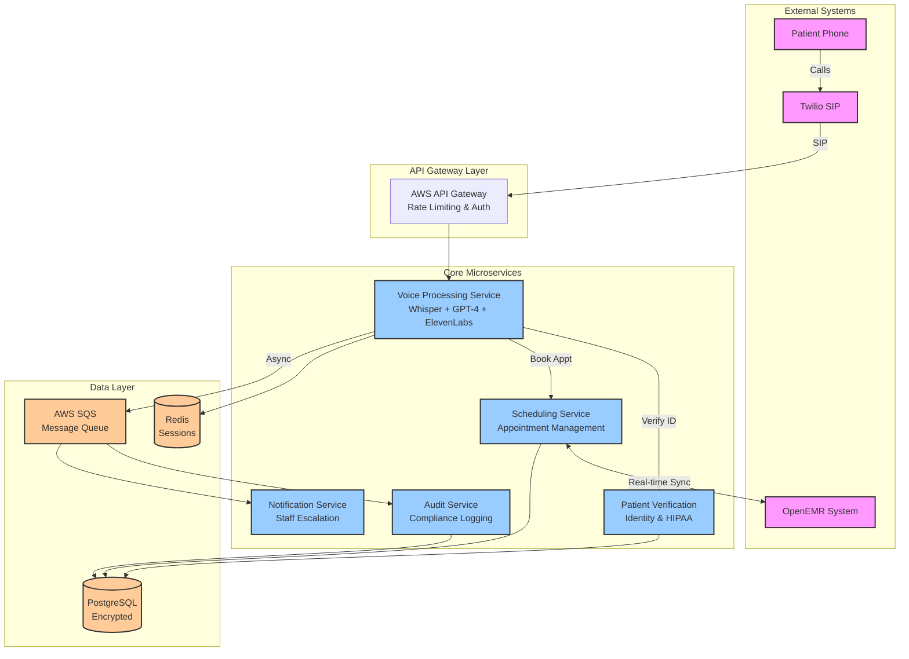

# High Level Architecture

## Technical Summary

The AI Voice Agent for Capitol Eye Care employs a **microservices architecture** built on Node.js/TypeScript, orchestrating voice AI services, appointment scheduling, and patient verification through secure, HIPAA-compliant communication channels. Core components include Twilio telephony integration, OpenAI Whisper/GPT-4 for voice processing, and real-time OpenEMR synchronization, all deployed on AWS HIPAA-eligible infrastructure. The system leverages event-driven patterns for scalability, implements comprehensive audit logging for compliance, and maintains 99.5% uptime through redundant service deployment. This architecture directly supports the PRD's revenue goals by enabling 24/7 appointment capture while reducing staff workload through intelligent call routing and automated scheduling.

## High Level Overview

1. **Architectural Style**: **Microservices Architecture** with event-driven communication
   - Enables independent scaling of voice processing vs. scheduling services
   - Fault isolation prevents single service failures from affecting entire system
   - Supports future platform expansion to multiple practices

2. **Repository Structure**: **Monorepo** (as specified in PRD)
   - Single repository with packages/ directory for all microservices
   - Shared TypeScript configurations and common utilities
   - Simplified dependency management for single developer

3. **Service Architecture**: **Dedicated Microservices** for:
   - Voice Processing Service (speech-to-text, NLP, text-to-speech)
   - Appointment Scheduling Service (OpenEMR integration)
   - Patient Verification Service (identity validation)
   - Audit Logging Service (HIPAA compliance)
   - Staff Notification Service (escalation handling)

4. **Primary User Flow**: 
   - Patient calls → Twilio receives → Voice Service processes → Patient Verification authenticates → Scheduling Service books appointment → OpenEMR updates → Confirmation provided

5. **Key Architectural Decisions**:
   - **Stateless services** for horizontal scaling
   - **Redis session management** for conversation context
   - **PostgreSQL** for application data with encryption at rest
   - **Message queue** (AWS SQS) for async operations
   - **Circuit breakers** for external service resilience

## High Level Project Diagram

## Architectural and Design Patterns

Based on the PRD requirements and microservices approach, here are the key patterns with recommendations:

- **Serverless Architecture:** Using AWS Lambda for compute - _Rationale:_ Cost optimization for variable call volume, automatic scaling for 24/7 availability, reduced operational overhead for single developer

- **Event-Driven Communication:** Using AWS SNS/SQS for service decoupling - _Rationale:_ Supports async audit logging, enables fault tolerance, allows independent service scaling

- **Repository Pattern:** Abstract data access logic for all database operations - _Rationale:_ Enables testing with mock data, provides consistent data access across services, simplifies future database migrations

- **Circuit Breaker Pattern:** Protect external service calls (OpenEMR, Twilio, AI services) - _Rationale:_ Prevents cascade failures, enables graceful degradation, maintains system stability during partner outages

- **Saga Pattern:** Manage distributed transactions across scheduling and verification - _Rationale:_ Ensures data consistency without distributed locks, enables compensation for failed appointments, maintains audit trail

- **API Gateway Pattern:** Centralize authentication, rate limiting, and routing - _Rationale:_ Single entry point for security, consistent rate limiting for HIPAA compliance, simplified client integration

- **CQRS Lite:** Separate read models for appointment queries - _Rationale:_ Optimizes voice response time, reduces load on OpenEMR, enables caching strategies

- **Domain-Driven Design:** Bounded contexts for each microservice - _Rationale:_ Clear service boundaries, reduced coupling, easier to maintain and scale
