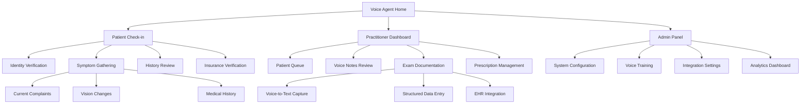

# Voice Agent UI/UX Specification

This document defines the user experience goals, information architecture, user flows, and visual design specifications for Voice Agent's user interface. It serves as the foundation for visual design and frontend development, ensuring a cohesive and user-centered experience.

## Introduction

### Overall UX Goals & Principles

#### Target User Personas

- **Healthcare Practitioner:** Optometrists and staff who need efficient patient interaction tools and streamlined clinical workflows
- **Patient:** Individuals seeking eye care who prefer conversational, anxiety-reducing interactions over traditional form-filling
- **Practice Administrator:** Staff managing system integration, patient data flow, and practice efficiency metrics

#### Usability Goals

- **Conversational Efficiency:** Reduce patient check-in time from 15 minutes to 5 minutes through voice interaction
- **Clinical Accuracy:** Achieve 95%+ accuracy in voice-to-text medical terminology capture
- **Emotional Comfort:** Reduce patient anxiety through natural, supportive voice interactions
- **Workflow Integration:** Seamless data flow between voice interactions and existing EHR systems
- **Error Recovery:** Clear voice-guided correction workflows for misunderstood inputs

#### Design Principles

1. **Voice-First, Visuals Support** - Optimize for audio interaction, use visual elements to reinforce spoken content
2. **Medical Safety First** - Every interaction prioritizes patient safety and data accuracy with confirmation loops
3. **Conversational Flow** - Natural dialogue patterns that reduce anxiety and feel supportive
4. **Context Preservation** - Maintain conversation context across system handoffs and interruptions
5. **Progressive Disclosure** - Present information based on clinical priority and patient comfort level

#### Change Log

| Date | Version | Description | Author |
|------|---------|-------------|--------|
| 2025-01-15 | 1.0 | Initial UI/UX specification | UX Expert Sally |

## Information Architecture (IA)

### Site Map / Screen Inventory



### Navigation Structure

**Primary Navigation:** Voice-primary navigation with commands like "Start check-in process", "Review patient queue", "Access admin settings", and "Help and support"

**Secondary Navigation:** Voice prompts guide users through workflows with visual breadcrumbs showing progress in multi-step processes. "Go back" and "repeat that" commands available throughout.

**Breadcrumb Strategy:** Voice announcements of current step and total steps with visual progress indicators on screen interfaces. Context-sensitive help available at each stage.

## User Flows

### Flow 1: Patient Voice Check-in

**User Goal:** Complete check-in process through voice interaction without staff assistance

**Entry Points:** 
- Patient approaches kiosk/tablet at reception
- Phone call to automated check-in line
- Mobile app voice activation

**Success Criteria:** 
- Patient identity verified and confirmed
- Current symptoms captured accurately
- Insurance status validated
- EHR updated with visit information

#### Flow Diagram

```mermaid
graph TD
    A[Patient arrives] --> B[Voice greeting: "Welcome to Dr. Smith's office"]
    B --> C[Identity verification: "Please state your name and date of birth"]
    C --> D{Voice recognition successful?}
    D -->|Yes| E[Confirm identity: "I found John Doe, born January 1st, 1980. Is this correct?"]
    D -->|No| F[Fallback: "I didn't catch that. Please spell your last name"]
    F --> C
    E --> G{Patient confirms?}
    G -->|Yes| H[Symptom gathering: "What brings you in today?"]
    G -->|No| I[Clarification: "Let me help you find your record"]
    I --> C
    H --> J[Process symptoms with medical NLU]
    J --> K[Confirm understanding: "So you're experiencing blurry vision in your left eye?"]
    K --> L{Patient confirms symptoms?}
    L -->|Yes| M[Insurance verification: "Checking your insurance coverage..."]
    L -->|No| N[Clarification: "Help me understand your symptoms better"]
    N --> H
    M --> O[Complete check-in: "You're all set! Please have a seat."]
    O --> P[Update EHR and notify staff]
```

#### Edge Cases & Error Handling:
- Background noise interference → "I'm having trouble hearing you. Could you move closer?"
- Ambiguous medical terms → "Did you mean [option A] or [option B]?"
- Patient with hearing impairment → Automatic fallback to visual interface
- System connectivity issues → "I'm having technical difficulties. Let me get a staff member."
- Insurance verification failure → "There may be an issue with your insurance. I'll flag this for our billing team."

**Notes:** Critical to maintain patient dignity during error recovery. All voice interactions should feel supportive, not frustrating.

### Flow 2: Practitioner Voice Documentation

**User Goal:** Document patient examination findings through voice while maintaining eye contact with patient

**Entry Points:**
- Voice activation during patient examination
- Post-examination documentation review
- Real-time note-taking during procedures

**Success Criteria:**
- Examination findings captured accurately in structured format
- Notes automatically formatted for EHR integration
- Practitioner maintains patient engagement throughout

#### Flow Diagram

```mermaid
graph TD
    A[Practitioner begins exam] --> B["Voice command: 'Start exam documentation for [patient name]'"]
    B --> C[System confirms: "Recording exam notes for John Doe"]
    C --> D[Practitioner speaks findings naturally]
    D --> E[Real-time transcription with medical terminology processing]
    E --> F[System identifies structured data elements]
    F --> G[Periodic confirmation: "I've noted 20/40 vision OS. Continue."]
    G --> H{More findings to document?}
    H -->|Yes| D
    H -->|No| I["Voice command: 'Review and finalize notes'"]
    I --> J[System reads back structured summary]
    J --> K{Practitioner approves?}
    K -->|Yes| L[Auto-populate EHR fields]
    K -->|No| M[Edit mode: "What would you like to change?"]
    M --> N[Voice-guided corrections]
    N --> J
    L --> O[Confirmation: "Notes saved to patient record"]
```

#### Edge Cases & Error Handling:
- Medical terminology misrecognition → Smart suggestions with confidence scoring
- Interruption by patient questions → Context preservation and resumption
- Practitioner speaks too quickly → "Please speak more slowly for accuracy"
- Technical jargon not in system vocabulary → Learning mode for new terms
- Conflicting data entry → "This differs from earlier notes. Should I update?"

**Notes:** Must feel invisible to patient experience while providing practitioner confidence in accuracy.

## Wireframes & Mockups

**Primary Design Files:** *[To be determined - design tool selection needed]*

### Key Screen Layouts

#### Patient Check-in Kiosk Interface

**Purpose:** Support voice check-in process with visual feedback and accessibility backup

**Key Elements:**
- Large, clear voice status indicator (listening/processing/speaking)
- Progress bar showing check-in steps (Identity → Symptoms → Insurance → Complete)
- Live transcription display of patient responses for verification
- "Tap here for text-based check-in" accessibility button
- Simple visual confirmations (checkmarks, patient name display)
- Emergency "Get Help" button always visible

**Interaction Notes:** Screen responds to voice commands but all functions available via touch for accessibility. Large text, high contrast for vision-impaired patients.

**Design File Reference:** *[Kiosk interface mockups to be created in chosen design tool]*

#### Practitioner Voice Notes Interface

**Purpose:** Provide real-time feedback during voice documentation without disrupting patient interaction

**Key Elements:**
- Minimal, unobtrusive recording indicator
- Live transcription preview (visible only to practitioner)
- Structured data extraction preview (vitals, symptoms, findings automatically categorized)
- Quick correction buttons for common issues
- Integration status with EHR system
- Patient privacy mode (screen blanking when not actively used)

**Interaction Notes:** Interface optimized for peripheral vision use. All controls voice-activated with visual confirmation. Screen auto-dims to avoid distraction during patient examination.

**Design File Reference:** *[Practitioner interface mockups showing voice interaction states]*

#### System Status Dashboard

**Purpose:** Provide administrators and staff with system health and usage monitoring

**Key Elements:**
- Voice recognition accuracy metrics
- Patient flow status and queue management
- System integration health (EHR connectivity, etc.)
- Recent error logs and resolution status
- Voice training and calibration tools
- HIPAA compliance monitoring dashboard

**Interaction Notes:** Traditional desktop interface with detailed analytics. Voice commands available but not primary interaction method.

**Design File Reference:** *[Admin dashboard with voice system metrics]*

## Component Library / Design System

**Design System Approach:** Create a hybrid design system that combines traditional visual components with voice interaction design patterns. This system will prioritize accessibility, voice-visual coordination, and medical interface requirements.

### Core Components

#### Voice Status Indicator

**Purpose:** Provide clear visual feedback for voice interaction states across all interfaces

**Variants:**
- Listening (animated pulse, blue)
- Processing (spinner with transcription preview, amber)
- Speaking (animated sound waves, green)
- Error/Retry (alert indicator, red)
- Standby (subtle breathing animation, gray)

**States:**
- Active: Full animation and color
- Disabled: Grayed out, no animation
- Loading: Transitional animations between states
- Error: Red pulsing with error message

**Usage Guidelines:** Always visible during voice interactions. Size scales based on interface context (large for kiosk, small for practitioner interface). Animation pauses for users who prefer reduced motion.

#### Live Transcription Display

**Purpose:** Show real-time voice-to-text conversion for user confidence and error detection

**Variants:**
- Patient-facing (large, high contrast text)
- Practitioner-facing (smaller, clinical terminology highlighting)
- Admin/review (detailed with confidence scores)

**States:**
- Active transcription: Real-time text with typing indicator
- Confidence scoring: Color-coded text based on recognition accuracy
- Edit mode: Editable text with voice correction options
- Confirmed: Text locked with checkmark

**Usage Guidelines:** Text appears progressively as spoken. Low-confidence words highlighted for review. Automatic pause for patient privacy when needed.

#### Medical Data Cards

**Purpose:** Display structured medical information captured from voice interactions

**Variants:**
- Symptom cards (patient-reported information)
- Examination findings (practitioner observations)
- Prescription cards (medication and instructions)
- Insurance/billing cards (coverage and payment info)

**States:**
- Draft: Information being captured, editable
- Pending verification: Awaiting confirmation
- Confirmed: Locked and integrated with EHR
- Error: Requiring attention or correction

**Usage Guidelines:** Auto-populate from voice transcription. Clear visual hierarchy for medical data types. Color-coding for urgency levels (normal, attention needed, critical).

#### Voice Command Buttons

**Purpose:** Provide visual alternatives to voice commands for accessibility

**Variants:**
- Primary actions (Start Check-in, Begin Documentation)
- Navigation (Back, Next, Repeat)
- System controls (Help, Emergency, Privacy Mode)
- Confirmation (Yes, No, Need Clarification)

**States:**
- Available: Standard button styling
- Voice-activated: Visual feedback when triggered by voice
- Processing: Loading state during command execution
- Disabled: Grayed out when unavailable

**Usage Guidelines:** All voice commands must have visual equivalents. Button labels match exact voice command phrases. Large touch targets for accessibility.

#### Progress Flow Indicators

**Purpose:** Show multi-step process progress for voice-guided workflows

**Variants:**
- Linear progress (check-in steps, documentation workflow)
- Circular progress (system processing, voice training)
- Branch indicators (decision points in voice flows)

**States:**
- Upcoming: Grayed out, not yet started
- Current: Highlighted, active voice interaction
- Completed: Checkmarked, confirmation displayed
- Error: Alert indicator, requires attention

**Usage Guidelines:** Always indicate current step and total steps. Voice announcements coordinate with visual progress. Allow jumping to completed steps when appropriate.

#### Privacy and Security Indicators

**Purpose:** Provide clear feedback about data handling and HIPAA compliance status

**Variants:**
- Recording status (mic active, processing, stored)
- Privacy mode (screen blanked, audio muted)
- Security status (encrypted, transmitted, error)
- Patient consent (permissions granted, restrictions)

**States:**
- Secure: Green indicators, normal operation
- Processing: Amber, temporary security operations
- Alert: Red, immediate attention required
- Disabled: Gray, security features inactive

**Usage Guidelines:** Security status always visible to users. Clear language about data handling. One-tap privacy controls available. HIPAA compliance indicators for staff interfaces.

## Branding & Style Guide

### Visual Identity

**Brand Guidelines:** *[To be determined - existing practice brand guidelines or new voice agent system guidelines needed]*

### Color Palette

| Color Type | Hex Code | Usage |
|------------|----------|--------|
| Primary | #2E7D89 | Voice status indicators, primary actions, medical data highlights |
| Secondary | #4A90A4 | Supporting elements, secondary navigation, progress indicators |
| Accent | #7CB342 | Success states, confirmation messages, positive feedback |
| Success | #4CAF50 | Successful voice recognition, completed tasks, positive confirmations |
| Warning | #FF9800 | Attention needed, low confidence transcription, review required |
| Error | #F44336 | Voice recognition errors, system failures, critical alerts |
| Neutral | #546E7A, #90A4AE, #ECEFF1 | Text, borders, backgrounds, disabled states |

**Medical Context Colors:**
- **Clinical Blue (#2E7D89):** Conveys trust, professionalism, medical accuracy
- **Calm Green (#7CB342):** Reduces anxiety, positive health outcomes
- **Alert Orange (#FF9800):** Medical attention without alarm, professional caution
- **Emergency Red (#F44336):** Critical medical situations, system errors requiring immediate action

### Typography

#### Font Families
- **Primary:** Inter (clean, highly legible for medical interfaces, excellent screen readability)
- **Secondary:** Source Sans Pro (accessible, professional, good voice transcription display)
- **Monospace:** JetBrains Mono (technical displays, system logs, precise data alignment)

#### Type Scale

| Element | Size | Weight | Line Height | Usage Context |
|---------|------|--------|-------------|---------------|
| H1 | 32px | 600 | 1.2 | Main screen titles, system announcements |
| H2 | 24px | 600 | 1.3 | Section headers, patient names, major status |
| H3 | 20px | 500 | 1.4 | Subsection headers, medical data categories |
| Body | 16px | 400 | 1.5 | General text, transcription display, instructions |
| Small | 14px | 400 | 1.4 | Helper text, metadata, timestamps, system info |
| Voice Text | 18px | 400 | 1.6 | Live transcription (larger for readability during voice interaction) |

### Iconography

**Icon Library:** Feather Icons + custom medical iconography for healthcare-specific functions

**Usage Guidelines:** 
- Consistent 24px base size with 16px and 32px variants
- Stroke weight matches typography (medium weight for clarity)
- Medical icons follow healthcare industry standards
- Voice-specific icons (microphone, sound waves, transcription) use animated variants
- All icons include text labels for accessibility

**Custom Voice Interface Icons:**
- 🎙️ Voice input active
- 🔊 System speaking
- 📝 Live transcription
- ✅ Voice command confirmed
- ⚠️ Voice recognition uncertain
- 🔒 Privacy mode active

### Spacing & Layout

**Grid System:** 8px base unit grid system for consistent spacing and alignment across voice and visual interfaces

**Spacing Scale:**
- xs: 4px (tight spacing, icon padding)
- sm: 8px (component internal spacing)
- md: 16px (standard component spacing)
- lg: 24px (section spacing)
- xl: 32px (major layout spacing)
- xxl: 48px (screen-level spacing)

**Voice Interface Specific Spacing:**
- Voice status indicators: 16px minimum from screen edges
- Transcription text: 24px margins for readability during voice interaction
- Touch targets: 44px minimum for accessibility (larger than standard for medical context)
- Privacy zones: 32px buffer around sensitive information displays

**Layout Principles:**
- **Voice-First Hierarchy:** Most important information largest and most prominent
- **Glanceable Design:** Key information readable at arm's length (kiosk usage)
- **Progressive Disclosure:** Complex information revealed through voice commands
- **Safety Margins:** Critical controls have adequate spacing to prevent accidental activation

**Medical Interface Considerations:**
- High contrast ratios (4.5:1 minimum) for vision-impaired patients
- Large touch targets for users with motor difficulties
- Clear visual hierarchy for emergency situations
- Consistent spacing for muscle memory in clinical workflows

## Accessibility Requirements

### Compliance Target

**Standard:** WCAG 2.1 AA compliance minimum, with AAA targets for critical medical functions. Additional compliance with Section 508 and ADA requirements for healthcare technology.

### Key Requirements

**Visual:**
- **Color contrast ratios:** 4.5:1 minimum for normal text, 7:1 for critical medical information, 3:1 for large text and UI components
- **Focus indicators:** High-visibility focus rings (3px minimum) with voice command coordination - visual focus follows voice navigation
- **Text sizing:** Scalable up to 200% without horizontal scrolling, with voice commands for "increase text size" and "decrease text size"

**Interaction:**
- **Keyboard navigation:** Complete keyboard accessibility with voice command alternatives - every visual element accessible via voice
- **Screen reader support:** Full ARIA implementation with voice interaction announcements, coordinated audio output management
- **Touch targets:** 44px minimum (larger than standard due to medical context and potential motor difficulties)

**Content:**
- **Alternative text:** Comprehensive alt text for all images, with voice descriptions available on request
- **Heading structure:** Logical H1-H6 hierarchy with voice navigation ("go to next heading", "read all headings")
- **Form labels:** Clear form labeling with voice-guided form completion and error correction

**Voice-Specific Accessibility:**

**Hearing Impairments:**
- Live visual transcription of all system speech output
- Haptic feedback options for voice interaction status
- Complete visual alternative workflows for all voice functions
- Sign language interpretation integration points
- Adjustable audio output with personal amplification device compatibility

**Speech Impairments:**
- Alternative input methods (typing, touch, eye-tracking integration)
- Voice sensitivity adjustments for speech difficulties
- Extended timeout options for voice responses
- Caregiver assistance modes for voice interaction
- Custom vocabulary training for speech patterns

**Cognitive Accessibility:**
- Simple, consistent language patterns in voice prompts
- Repetition options ("repeat that", "say it differently")
- Progress tracking with voice announcements
- Clear error messaging with suggested corrections
- Pause and resume functionality for processing time

**Motor Impairments:**
- Voice activation for all physical interactions
- Large touch target areas (60px for primary medical functions)
- Gesture-free interaction options
- Extended interaction timeouts
- Single-action alternatives for complex gestures

**Vision Impairments:**
- High contrast mode with voice activation
- Voice-guided navigation with spatial descriptions
- Detailed audio descriptions of visual elements
- Screen reader optimization with voice coordination
- Magnification tools with voice control

### Testing Strategy

**Multi-Modal Testing Approach:**
1. **Automated Accessibility Testing:** WAVE, axe-core, and Lighthouse audits for visual interface compliance
2. **Voice Interaction Testing:** Custom testing for voice navigation, command recognition, and audio output coordination
3. **Assistive Technology Testing:** Screen readers (NVDA, JAWS, VoiceOver), voice recognition software, and switch navigation devices
4. **User Testing with Disabilities:** Direct testing with users who have various accessibility needs in medical settings
5. **Medical Context Testing:** Accessibility validation during actual patient care scenarios with time pressure and stress factors

**Specific Testing Scenarios:**
- Patient with hearing aids using voice check-in system
- Elderly patient with vision impairment navigating voice interface
- Patient with speech difficulties completing symptom reporting
- Wheelchair user accessing kiosk with voice and touch alternatives
- Patient with cognitive impairment following voice-guided workflows

**Testing Schedule:**
- Automated testing: Every development sprint
- Assistive technology testing: Monthly during development
- User testing: Quarterly with diverse accessibility needs
- Medical context testing: Before each major release

**Compliance Validation:**
- WCAG 2.1 AA audit before production release
- Section 508 compliance verification for government healthcare facilities
- ADA compliance review with healthcare accessibility specialists
- HIPAA accessibility requirements validation

## Responsiveness Strategy

### Breakpoints

| Breakpoint | Min Width | Max Width | Target Devices | Voice Context |
|------------|-----------|-----------|----------------|---------------|
| Mobile | 320px | 767px | Patient smartphones, small tablets | Personal voice assistant, appointment scheduling |
| Tablet | 768px | 1023px | Patient kiosk tablets, practitioner tablets | Primary check-in interface, mobile documentation |
| Desktop | 1024px | 1439px | Practitioner workstations, admin interfaces | Full clinical workflows, system management |
| Wide | 1440px | - | Large monitors, wall displays | Multi-patient dashboards, training interfaces |

### Adaptation Patterns

**Layout Changes:**
- **Mobile:** Single-column voice interaction with minimal visual elements, focus on transcription display and voice status
- **Tablet:** Two-column layout with voice controls on left, visual feedback/transcription on right, optimized for kiosk touch interaction
- **Desktop:** Multi-panel interface with voice controls, live transcription, patient data, and system status visible simultaneously
- **Wide:** Dashboard view with multiple patient streams, system monitoring, and comprehensive voice interaction analytics

**Navigation Changes:**
- **Mobile:** Voice-primary navigation with hamburger menu for visual backup, swipe gestures for workflow steps
- **Tablet:** Voice commands with large touch targets, visible navigation breadcrumbs, prominent voice status indicator
- **Desktop:** Traditional menu structure with voice shortcuts, keyboard navigation, comprehensive accessibility options
- **Wide:** Advanced navigation with voice command palette, multi-window management, administrative oversight controls

**Content Priority:**
- **Mobile:** Voice status → Patient identity → Current step → Essential actions only
- **Tablet:** Voice interaction → Progress indicator → Transcription → Secondary actions
- **Desktop:** Full workflow visibility → Voice tools → Patient data → System status → Administrative functions
- **Wide:** System overview → Multiple patient streams → Analytics → Voice system management → Training tools

**Interaction Changes:**
- **Mobile:** Voice-first with touch fallback, simplified confirmation flows, large voice activation areas
- **Tablet:** Balanced voice/touch interaction, optimized for arm's length operation, accessibility-first design
- **Desktop:** Full interaction suite with voice shortcuts, keyboard navigation, mouse precision for detailed tasks
- **Wide:** Multi-modal interaction with voice coordination across multiple workflows and user sessions

### Device-Specific Voice Considerations

**Mobile Devices (Personal Assistant Context):**
- Background noise filtering for phone environments
- Personal voice profile recognition for returning patients
- Simplified command vocabulary for quick interactions
- Integration with personal health apps and calendars

**Tablet Kiosks (Primary Check-in Interface):**
- Optimized microphone positioning and noise cancellation
- Multiple user voice profile switching
- Visual privacy modes during voice interaction
- Easy staff reset and cleaning protocols

**Desktop Workstations (Clinical Documentation):**
- Professional-grade audio equipment integration
- Multi-user voice profiles for shared workstations
- Integration with existing clinical workflow software
- Advanced voice training and customization options

**Large Displays (System Monitoring):**
- Room-scale voice commands for hands-free operation
- Multiple concurrent voice session management
- Public address integration for announcements
- Emergency communication coordination

## Animation & Micro-interactions

### Motion Principles

**Voice-Supportive Animation Philosophy:**
1. **Functional First** - Every animation serves a clear purpose in voice interaction feedback
2. **Calming Presence** - Motion reduces anxiety and creates trust in medical settings
3. **Accessibility Conscious** - Respects motion sensitivity preferences while maintaining functionality
4. **Performance Optimized** - Smooth animations that don't interfere with voice processing
5. **Contextually Appropriate** - Professional medical environment standards with human warmth

### Key Animations

#### Voice Status Animations

- **Listening State:** Gentle pulsing ring around microphone icon (Duration: 1.2s cycle, Easing: ease-in-out)
- **Processing State:** Subtle spinner with transcription text appearing progressively (Duration: 0.8s rotation, Easing: linear)
- **Speaking State:** Sound wave visualization synchronized with system speech (Duration: matches audio, Easing: ease-out)
- **Error State:** Gentle shake with color transition to error state (Duration: 0.4s, Easing: ease-out)
- **Success Confirmation:** Check mark animation with subtle scale and fade (Duration: 0.6s, Easing: ease-out)

#### Transcription and Data Entry

- **Text Appearance:** Words appear with gentle fade-in as voice recognition processes (Duration: 0.3s per word, Easing: ease-in)
- **Confidence Indicators:** Color transitions for recognition confidence levels (Duration: 0.5s, Easing: ease-in-out)
- **Data Card Population:** Medical information cards slide in with staggered timing (Duration: 0.4s, Easing: ease-out)
- **Edit Mode Transition:** Smooth transition from read-only to editable state (Duration: 0.3s, Easing: ease-in-out)

#### Navigation and Flow

- **Progress Indicators:** Smooth progress bar advancement with voice step announcements (Duration: 0.8s, Easing: ease-out)
- **Screen Transitions:** Gentle slide transitions between workflow steps (Duration: 0.5s, Easing: ease-in-out)
- **Modal Appearances:** Privacy mode and help overlays with backdrop blur (Duration: 0.4s, Easing: ease-out)
- **Focus Transitions:** Visual focus moves smoothly to match voice navigation (Duration: 0.2s, Easing: ease-in-out)

#### Medical Context Specific

- **Privacy Mode Activation:** Screen content fades to privacy state with audio cue (Duration: 0.6s, Easing: ease-in)
- **Emergency Alert:** Urgent but not alarming pulse animation for critical notifications (Duration: 1.0s cycle, Easing: ease-in-out)
- **Patient Data Confirmation:** Gentle highlight and scale for important medical information verification (Duration: 0.5s, Easing: ease-out)
- **System Health Indicators:** Breathing animation for normal operation, subtle alerts for attention needed (Duration: 2.0s cycle, Easing: ease-in-out)

## Performance Considerations

### Performance Goals

- **Voice Response Time:** <300ms from voice command to system acknowledgment
- **Transcription Display:** <500ms from speech end to text appearance
- **Page Load:** <2 seconds for all interfaces
- **Voice Processing Accuracy:** >95% first-attempt recognition for medical terminology
- **System Availability:** 99.9% uptime
- **Interaction Response:** <100ms for touch/click feedback
- **Animation FPS:** Consistent 60fps for voice status indicators
- **Cross-Device Sync:** <1 second for voice profile and session data synchronization

### Design Strategies

**Voice-First Performance Optimization:**
- Predictive voice processing with pre-loaded medical terminology models
- Cache frequent voice commands and responses for instant feedback
- Background processing during user pauses in conversation
- Smart buffering of voice input during network latency

**Visual Interface Efficiency:**
- Minimal DOM complexity during active voice interactions
- Progressive image loading with voice-navigation priorities
- Component lazy-loading based on voice workflow progression
- Efficient animation techniques that don't compete with voice processing

**Medical Context Performance:**
- Redundant systems for critical voice functions
- Performance monitoring with automatic degradation for non-essential features
- HIPAA-compliant caching strategies that balance security with speed
- Real-time performance dashboards for medical staff

## Next Steps

### Immediate Actions

1. **Stakeholder Review** - Present this specification to medical staff, administrators, and IT team for validation and feedback
2. **Design Tool Setup** - Choose and configure design tool (Figma recommended) for detailed visual mockups and voice interaction prototypes
3. **Voice Technology Evaluation** - Research and select voice recognition technology optimized for medical terminology
4. **Accessibility Audit Planning** - Schedule accessibility review with healthcare accessibility specialists
5. **Integration Planning** - Begin technical discussions with EHR vendors for voice system integration requirements
6. **User Testing Protocol** - Develop testing plan with real patients and medical staff in controlled environment

### Design Handoff Checklist

- [x] All user flows documented with voice interaction patterns
- [x] Component inventory complete with voice-specific elements
- [x] Accessibility requirements defined for medical voice interface
- [x] Responsive strategy clear for all medical facility device contexts
- [x] Brand guidelines incorporated with medical professionalism standards
- [x] Performance goals established for clinical workflow efficiency

---

*This specification was created through collaborative design sessions focusing on voice-first interaction patterns for medical environments. All requirements prioritize patient safety, accessibility, and clinical workflow efficiency.*