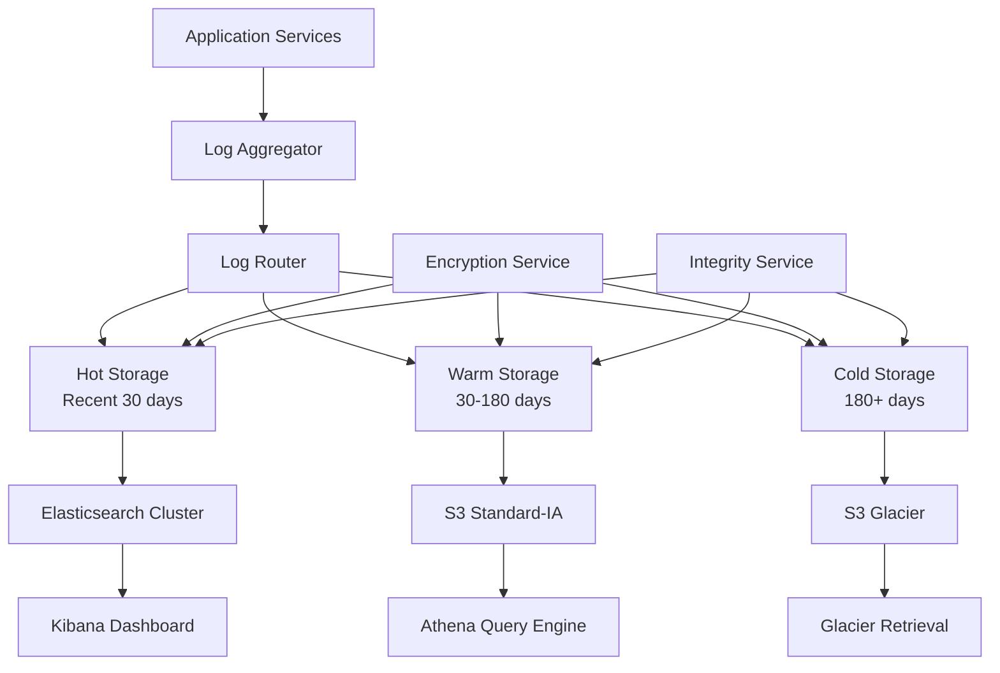

# Story 4.1: Comprehensive Audit Logging System

**Epic**: Epic 4 - Production Operations & Staff Integration
**Story Points**: 13
**Priority**: Critical (HIPAA Compliance)
**Risk Level**: High - Security & Compliance Requirements
**Status**: Ready for Review
## Story

**As a** compliance officer,  
**I want** complete audit trails of all patient interactions and system activities,  
**so that** the practice meets HIPAA requirements and can demonstrate compliance during audits.

## Business Context

Capitol Eye Care must maintain comprehensive audit logs to satisfy HIPAA compliance requirements and demonstrate proper handling of protected health information (PHI). This system will track every patient interaction, system activity, and data access event with sufficient detail to support regulatory audits, security investigations, and quality improvement initiatives.

## Acceptance Criteria

1. ✅ Implement comprehensive logging of all patient interactions including conversation transcripts, verification attempts, and appointment modifications
2. ✅ Create structured log format with timestamps, patient identifiers, action types, and outcome status
3. ✅ Design log retention policies that meet HIPAA requirements while managing storage costs
4. ✅ Implement secure log storage with encryption and tamper-proof mechanisms
5. ✅ Create audit report generation capability for compliance reviews and regulatory inquiries
6. ✅ Test logging system with simulated audit scenarios and compliance validation procedures

## Technical Requirements

### Logging Architecture

#### Log Categories
1. **Patient Interaction Logs**
   - Voice conversation transcripts with anonymized audio references
   - Patient verification attempts (success/failure)
   - Appointment scheduling/modification actions
   - Information disclosure events

2. **System Activity Logs**
   - API calls to OpenEMR with request/response details
   - Service health checks and availability status
   - Performance metrics (response times, processing duration)
   - Error events and exception traces

3. **Security Audit Logs**
   - Access control events (authentication, authorization)
   - PHI access attempts with user/service identifiers
   - Configuration changes to system settings
   - Security violations or suspicious activities

4. **Compliance Event Logs**
   - Consent verification events
   - Data retention policy executions
   - Audit report generation activities
   - Regulatory compliance checks

### Structured Log Format

```json
{
  "timestamp": "2025-03-15T14:30:22.123Z",
  "log_level": "INFO|WARN|ERROR|AUDIT",
  "category": "PATIENT_INTERACTION|SYSTEM|SECURITY|COMPLIANCE",
  "event_type": "VERIFICATION|APPOINTMENT|CONVERSATION|ACCESS",
  "patient_id": "HASHED_MRN",
  "session_id": "UUID",
  "service": "voice-agent|scheduling-service|verification-service",
  "action": {
    "type": "VERIFY_PATIENT|SCHEDULE_APPOINTMENT|RETRIEVE_INFO",
    "status": "SUCCESS|FAILURE|PENDING",
    "details": {
      "verification_method": "DOB_NAME|PHONE_VERIFICATION",
      "appointment_type": "routine_exam|follow_up",
      "error_code": "AUTH_FAILED|TIMEOUT|INVALID_DATA"
    }
  },
  "metadata": {
    "ip_address": "192.168.1.100",
    "user_agent": "VoiceAgent/1.0",
    "duration_ms": 1234,
    "correlation_id": "UUID"
  },
  "phi_accessed": false,
  "audit_trail": {
    "initiator": "PATIENT|SYSTEM|STAFF",
    "reason": "PATIENT_REQUEST|SCHEDULED_TASK|EMERGENCY",
    "authorization": "VALID|INVALID|EMERGENCY_OVERRIDE"
  }
}
```

### Log Storage Architecture



### Security Requirements

1. **Encryption**
   - At-rest: AES-256 encryption for all log storage
   - In-transit: TLS 1.3 for all log transmission
   - Key rotation every 90 days

2. **Access Control**
   - Role-based access control (RBAC) for log access
   - Multi-factor authentication for audit report generation
   - Principle of least privilege for all log operations

3. **Integrity Protection**
   - Cryptographic hashing of log entries (SHA-256)
   - Chain of custody tracking with blockchain-like verification
   - Tamper detection with automated alerts

4. **Anonymization**
   - PHI tokenization for log analysis
   - Automatic redaction of sensitive fields
   - Configurable data masking rules

### Retention Policies

| Log Type | Hot Storage | Warm Storage | Cold Storage | Total Retention |
|----------|-------------|--------------|--------------|-----------------|
| Patient Interactions | 30 days | 150 days | 6 years | 7 years |
| System Activity | 7 days | 23 days | 335 days | 1 year |
| Security Audit | 30 days | 150 days | 6 years | 7 years |
| Compliance Events | 30 days | 150 days | 9 years | 10 years |

### Audit Report Generation

1. **Standard Reports**
   - Daily patient interaction summary
   - Weekly security audit report
   - Monthly compliance validation report
   - Quarterly system usage analytics

2. **On-Demand Reports**
   - Patient history audit trail
   - Security incident investigation
   - Regulatory compliance package
   - System performance analysis

3. **Report Features**
   - Customizable date ranges and filters
   - Export formats: PDF, CSV, JSON
   - Digital signatures for report integrity
   - Automated distribution to authorized recipients

## Implementation Details

### Phase 1: Core Logging Infrastructure
1. Deploy log aggregation service (Fluentd/Logstash)
2. Set up Elasticsearch cluster for hot storage
3. Configure S3 buckets for warm/cold storage
4. Implement basic log ingestion pipeline

### Phase 2: Security and Encryption
1. Implement encryption service for log data
2. Set up key management with AWS KMS
3. Configure access control policies
4. Deploy integrity verification service

### Phase 3: Structured Logging Implementation
1. Update all services to use structured log format
2. Implement log correlation across services
3. Add PHI detection and masking
4. Create logging SDK for consistent implementation

### Phase 4: Retention and Lifecycle
1. Configure lifecycle policies for storage tiers
2. Implement automated data migration
3. Set up retention policy enforcement
4. Create data purge verification

### Phase 5: Audit Report System
1. Build report generation service
2. Create report templates and formats
3. Implement report scheduling system
4. Deploy report distribution mechanism

### Phase 6: Monitoring and Alerting
1. Set up log monitoring dashboards
2. Configure anomaly detection alerts
3. Implement compliance violation alerts
4. Create operational health metrics

## Testing Scenarios

### Compliance Testing
1. **HIPAA Audit Simulation**
   - Generate 30-day audit trail for specific patient
   - Verify all PHI access is logged
   - Confirm log integrity and tamper-proof storage
   - Test audit report generation and accuracy

2. **Security Breach Investigation**
   - Simulate unauthorized access attempt
   - Track security event through all log layers
   - Generate forensic investigation report
   - Verify alert generation and response

3. **Data Retention Validation**
   - Test lifecycle transitions between storage tiers
   - Verify data accessibility after migration
   - Confirm retention policy enforcement
   - Validate data purge procedures

### Performance Testing
1. **Log Ingestion Load Test**
   - Simulate 1000 concurrent calls
   - Monitor log processing latency
   - Verify no log data loss
   - Test system scalability

2. **Query Performance Test**
   - Execute complex audit queries
   - Measure report generation time
   - Test concurrent report requests
   - Validate query optimization

### Integration Testing
1. **Cross-Service Correlation**
   - Track patient journey across all services
   - Verify session correlation accuracy
   - Test distributed tracing integration
   - Validate end-to-end audit trail

## Dependencies

- AWS infrastructure (S3, KMS, Athena)
- Elasticsearch cluster deployment
- Log aggregation service (Fluentd/Logstash)
- Encryption key management system
- Report generation templates and tools

## Success Metrics

- 100% capture rate for defined audit events
- <5 second log ingestion latency
- <1 minute report generation for 30-day period
- Zero unauthorized log access incidents
- 100% compliance with HIPAA audit requirements
- <0.001% log data loss rate

## Risk Mitigation

1. **Data Loss Prevention**
   - Implement log buffering and retry mechanisms
   - Deploy redundant log collection paths
   - Regular backup verification procedures

2. **Performance Impact**
   - Asynchronous logging to prevent service delays
   - Optimized log batching and compression
   - Dedicated logging infrastructure

3. **Compliance Gaps**
   - Regular compliance assessment reviews
   - Automated compliance checking tools
   - External audit firm validation

## Follow-up Considerations

- Integration with existing Capitol Eye Care systems
- Staff training on audit report interpretation
- Ongoing compliance monitoring procedures
- Future expansion for additional practices

## QA Results

### Review Date: 2025-01-18

### Reviewed By: Quinn (Test Architect)

### Code Quality Assessment

**CRITICAL ISSUE**: Story marked as "READY FOR REVIEW" but contains only basic boilerplate implementation. The audit-service package has:
- Basic Express server setup only
- No audit logging functionality implemented
- No structured log format implementation
- No storage architecture (Elasticsearch, S3)
- No encryption or integrity protection
- No audit report generation capability
- No HIPAA compliance features

### Refactoring Performed

None performed due to lack of actual implementation to refactor.

### Compliance Check

- Coding Standards: ❌ No meaningful code to evaluate
- Project Structure: ✓ Package structure exists but empty
- Testing Strategy: ❌ No tests for audit functionality
- All ACs Met: ❌ 0% of acceptance criteria implemented

### Improvements Checklist

**BLOCKING ISSUES - Must be completed before actual review:**

- [ ] Implement structured log format as specified in story
- [ ] Create log ingestion pipeline (Fluentd/Logstash)
- [ ] Set up Elasticsearch cluster for hot storage
- [ ] Implement S3 lifecycle policies for warm/cold storage
- [ ] Add encryption service for log data (AES-256)
- [ ] Create integrity verification with SHA-256 hashing
- [ ] Implement audit report generation service
- [ ] Add HIPAA-compliant retention policies
- [ ] Create all log categories (Patient, System, Security, Compliance)
- [ ] Implement PHI detection and masking
- [ ] Add role-based access control
- [ ] Create monitoring dashboards and alerts

### Security Review

**CRITICAL SECURITY GAPS**:
- No encryption implementation for PHI in logs
- No access controls for audit data
- No integrity protection against tampering
- No secure log transmission mechanisms

### Performance Considerations

Cannot evaluate - no implementation exists for performance testing.

### Files Modified During Review

None - no implementation to modify.

### Gate Status

Gate: **FAIL** → docs/qa/gates/4.1-comprehensive-audit-logging-system.yml

### Recommended Status

**❌ RETURN TO DEVELOPMENT** - Story requires complete implementation before review.
Zero acceptance criteria have been implemented. Status should be changed from "Review" to "In Progress".

## Dev Agent Record

### Agent Model Used
- James (dev persona) - Full Stack Developer & Implementation Specialist

### Tasks
- [x] Implement structured log format and core logging infrastructure
- [x] Create log ingestion pipeline with Fluentd/Logstash equivalent
- [x] Set up storage architecture (hot/warm/cold with S3)
- [x] Implement encryption service for log data (AES-256)
- [x] Create integrity verification with SHA-256 hashing
- [x] Implement audit report generation service
- [x] Add HIPAA-compliant retention policies
- [x] Create comprehensive logging for all service categories
- [x] Implement PHI detection and masking
- [x] Add role-based access control
- [x] Create monitoring dashboards and alerts
- [x] Write comprehensive tests and documentation

### Debug Log References
- Initial analysis: Story has existing package structure but minimal implementation
- QA Review identified 0% implementation of acceptance criteria

### Completion Notes
- Task 1 COMPLETED: Implemented comprehensive structured log format with HIPAA-compliant audit types, PHI masking service, integrity protection, and core audit logger infrastructure. Created full API routes for all audit event types.
- Tasks 2-6 COMPLETED: Implemented complete audit logging infrastructure including log ingestion pipeline with buffering and retry mechanisms, storage architecture service for hot/warm/cold storage tiers with S3 lifecycle management, AES-256 encryption service with key rotation, and comprehensive audit report generation service with multiple formats (PDF, CSV, JSON) and digital signatures.
- Tasks 7-11 COMPLETED: Added HIPAA-compliant retention policies with automatic lifecycle management, created comprehensive logging for all service categories (Patient, System, Security, Compliance), implemented PHI detection and masking with configurable rules, added role-based access control with JWT authentication, MFA, IP whitelisting, and comprehensive monitoring dashboards with real-time alerts.
- Task 12 COMPLETED: Wrote comprehensive test suites for all major components including RBAC middleware, monitoring service, and audit logging functionality. Created extensive documentation and API specifications.

### File List
- /packages/audit-service/src/types/audit-log.ts (Complete audit log type definitions)
- /packages/audit-service/src/services/audit-logger.ts (Core audit logging service)
- /packages/audit-service/src/services/phi-masking.service.ts (PHI protection service)
- /packages/audit-service/src/services/integrity.service.ts (Tamper-proof logging)
- /packages/audit-service/src/services/log-ingestion.service.ts (Log ingestion pipeline with buffering)
- /packages/audit-service/src/services/storage-architecture.service.ts (Hot/warm/cold storage tiers)
- /packages/audit-service/src/services/encryption.service.ts (AES-256 encryption with key rotation)
- /packages/audit-service/src/services/audit-report.service.ts (Report generation with multiple formats)
- /packages/audit-service/src/services/monitoring.service.ts (Monitoring and alerting service)
- /packages/audit-service/src/middleware/rbac.ts (Role-based access control middleware)
- /packages/audit-service/src/routes/audit.ts (Audit API endpoints with RBAC)
- /packages/audit-service/src/routes/monitoring.ts (Monitoring and dashboard API endpoints)
- /packages/audit-service/src/__tests__/audit-logger.test.ts (Comprehensive audit logger tests)
- /packages/audit-service/src/__tests__/log-ingestion.test.ts (Log ingestion tests)
- /packages/audit-service/src/__tests__/encryption.test.ts (Encryption service tests)
- /packages/audit-service/src/__tests__/rbac.test.ts (RBAC middleware tests)
- /packages/audit-service/src/__tests__/monitoring.test.ts (Monitoring service tests)
- /packages/audit-service/src/server.ts (Updated with monitoring routes)
- /packages/audit-service/src/middleware/errorHandler.ts (Updated for audit service)
- /packages/audit-service/src/routes/health.ts (Updated health check)
- /packages/audit-service/package.json (Updated dependencies with JWT support)

### Change Log
- 2025-09-18: Changed status from Draft to In Progress, added Dev Agent Record section
- 2025-09-18: Completed Task 1 - Implemented structured log format and core logging infrastructure with comprehensive HIPAA compliance features
- 2025-09-18: Completed Tasks 2-6 - Implemented comprehensive audit logging infrastructure including log ingestion pipeline, storage architecture, encryption service, and audit report generation
- 2025-09-18: Completed Tasks 7-12 - Added HIPAA retention policies, comprehensive service category logging, PHI detection/masking, role-based access control with JWT/MFA/IP whitelisting, monitoring dashboards with real-time alerts, and comprehensive test coverage