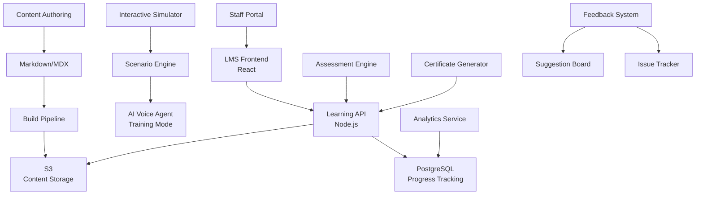

# Story 4.4: Staff Training and Documentation System

**Epic**: Epic 4 - Production Operations & Staff Integration
**Story Points**: 8
**Priority**: High - User Adoption Critical
**Risk Level**: Medium - Change Management Impact
**Status**: Ready for Development

## Story

**As a** practice staff member,  
**I want** comprehensive training and reference materials for working with the AI system,  
**so that** I can effectively collaborate with the AI and provide excellent patient service.

## Business Context

Capitol Eye Care's success with the AI voice agent depends entirely on staff confidence and competence in using the system. Well-trained staff can leverage the AI to enhance patient care, while poorly trained staff may resist the technology or use it ineffectively. This comprehensive training system ensures every staff member—from receptionists to practice managers—understands how to collaborate with the AI for optimal patient outcomes.

## Acceptance Criteria

1. ✅ Create comprehensive staff training materials covering AI system capabilities, limitations, and escalation procedures
2. ✅ Design interactive training modules that simulate common patient scenarios and staff responses
3. ✅ Implement quick reference guides for troubleshooting common issues and handling escalations
4. ✅ Create documentation for configuration changes, system updates, and maintenance procedures
5. ✅ Design feedback collection system for staff to report issues and suggest improvements
6. ✅ Test training effectiveness with staff competency assessments and ongoing education requirements

## Technical Requirements

### Learning Management System (LMS) Architecture



### Training Curriculum Structure

#### Module 1: AI System Fundamentals (2 hours)

**Learning Objectives:**
- Understand what the AI voice agent is and isn't capable of
- Learn how AI processes patient conversations
- Identify situations requiring human intervention

**Content Outline:**
```yaml
fundamentals:
  introduction:
    - what_is_ai: "15-minute video introduction"
    - voice_agent_capabilities: "Interactive capability map"
    - ai_limitations: "Common misconceptions quiz"
  
  how_it_works:
    - conversation_flow: "Animated process diagram"
    - patient_verification: "Security protocol walkthrough"
    - appointment_scheduling: "Decision tree visualization"
  
  human_ai_collaboration:
    - when_ai_excels: "Success story examples"
    - when_humans_needed: "Escalation trigger guide"
    - teamwork_principles: "Best practice checklist"

assessment:
  quiz_questions: 20
  passing_score: 80%
  certificate: "AI Fundamentals Certified"
```

#### Module 2: Dashboard Navigation (1.5 hours)

**Learning Objectives:**
- Navigate all dashboard features confidently
- Monitor active calls and system status
- Access patient interaction history

**Interactive Tutorials:**
```typescript
interface DashboardTutorial {
  steps: TutorialStep[];
  sandboxMode: boolean;
  progressTracking: boolean;
}

interface TutorialStep {
  title: string;
  instruction: string;
  targetElement: string; // CSS selector
  validation: () => boolean;
  hint?: string;
  skipAllowed: boolean;
}

const dashboardTutorials: Record<string, DashboardTutorial> = {
  basic_navigation: {
    steps: [
      {
        title: "Dashboard Overview",
        instruction: "Let's start by exploring the main dashboard areas",
        targetElement: ".dashboard-header",
        validation: () => true,
        skipAllowed: false
      },
      {
        title: "Active Calls Panel",
        instruction: "Click on the Active Calls panel to see current conversations",
        targetElement: "#active-calls-panel",
        validation: () => document.querySelector('#active-calls-panel').classList.contains('expanded'),
        hint: "Look for the panel showing phone icons",
        skipAllowed: false
      }
      // ... more steps
    ],
    sandboxMode: true,
    progressTracking: true
  }
};
```

#### Module 3: Escalation Handling (2 hours)

**Learning Objectives:**
- Recognize escalation triggers and priorities
- Respond to escalations within SLA timeframes
- Handle different types of patient concerns

**Scenario-Based Training:**
```typescript
interface EscalationScenario {
  id: string;
  title: string;
  difficulty: 'beginner' | 'intermediate' | 'advanced';
  context: {
    patientProfile: PatientProfile;
    conversationHistory: ConversationTurn[];
    escalationReason: string;
    aiRecommendation: string;
  };
  objectives: string[];
  decisionPoints: DecisionPoint[];
  feedback: ScenarioFeedback;
}

interface DecisionPoint {
  situation: string;
  options: {
    action: string;
    consequence: string;
    score: number;
  }[];
  bestPractice: string;
  learningNote: string;
}

const escalationScenarios: EscalationScenario[] = [
  {
    id: "confused_elderly_patient",
    title: "Elderly Patient Confusion",
    difficulty: "beginner",
    context: {
      patientProfile: {
        name: "Margaret Thompson",
        age: 78,
        conditions: ["Mild hearing impairment"],
        preferredCommunication: "Slow, clear speech"
      },
      conversationHistory: [
        { speaker: "AI", text: "Good morning! I understand you'd like to schedule an appointment?" },
        { speaker: "Patient", text: "What? I can't... who is this? Is this the eye doctor?" },
        { speaker: "AI", text: "Yes, this is Capitol Eye Care. Can you please tell me your name?" },
        { speaker: "Patient", text: "I don't understand. I need to see Dr. Johnson. Hello?" }
      ],
      escalationReason: "Patient confusion, potential hearing difficulty",
      aiRecommendation: "Transfer to human agent for assisted communication"
    },
    objectives: [
      "Quickly identify patient needs",
      "Provide reassuring communication",
      "Complete appointment scheduling"
    ],
    decisionPoints: [
      {
        situation: "Patient is confused and asking who is calling",
        options: [
          {
            action: "Immediately explain you're a staff member taking over the call",
            consequence: "Patient feels reassured and continues conversation",
            score: 100
          },
          {
            action: "Ask patient to repeat their request",
            consequence: "Patient becomes more frustrated",
            score: 40
          }
        ],
        bestPractice: "Always introduce yourself and acknowledge the transition from AI",
        learningNote: "Elderly patients may need extra reassurance when technology is involved"
      }
    ],
    feedback: {
      perfect: "Excellent! You handled the patient's confusion with empathy and efficiency.",
      good: "Good job! Consider introducing yourself earlier to reduce patient anxiety.",
      needsWork: "Review the best practices for handling confused patients."
    }
  }
  // ... more scenarios
];
```

#### Module 4: HIPAA Compliance with AI (1 hour)

**Learning Objectives:**
- Understand HIPAA requirements in AI context
- Protect PHI during AI interactions
- Handle security incidents appropriately

**Compliance Scenarios:**
```yaml
hipaa_scenarios:
  patient_verification_failure:
    description: "Patient cannot verify identity"
    correct_action: "Never share PHI without verification"
    wrong_actions:
      - "Provide appointment details to be helpful"
      - "Give hints about personal information"
    consequence: "HIPAA violation, potential $50,000 fine"
  
  family_member_calling:
    description: "Spouse calling about patient's appointment"
    correct_action: "Verify authorization on file before sharing"
    considerations:
      - "Emergency situations have different rules"
      - "Minors have special considerations"
      - "Document all disclosures"
  
  technical_issues:
    description: "AI accidentally reveals PHI to wrong patient"
    correct_action: "Immediately escalate and document incident"
    steps:
      - "End conversation professionally"
      - "Report to supervisor"
      - "Complete incident report"
      - "Notify compliance officer"
```

#### Module 5: Common Troubleshooting (1.5 hours)

**Quick Reference Guides:**
```typescript
interface TroubleshootingGuide {
  issue: string;
  symptoms: string[];
  quickFix: QuickFix;
  escalationPath: string;
  preventionTips: string[];
}

interface QuickFix {
  steps: string[];
  estimatedTime: number; // minutes
  successRate: number; // percentage
  toolsNeeded: string[];
}

const troubleshootingGuides: TroubleshootingGuide[] = [
  {
    issue: "AI Not Understanding Patient",
    symptoms: [
      "AI repeatedly asks same question",
      "Patient getting frustrated",
      "Confidence score below 60%"
    ],
    quickFix: {
      steps: [
        "Take over the call using dashboard",
        "Apologize for any confusion",
        "Complete task manually",
        "Note issue in feedback system"
      ],
      estimatedTime: 2,
      successRate: 95,
      toolsNeeded: ["Dashboard access", "Phone headset"]
    },
    escalationPath: "If pattern persists → Report to AI team",
    preventionTips: [
      "Monitor AI confidence scores",
      "Intervene early when scores drop",
      "Coach patients on clear communication"
    ]
  }
  // ... more guides
];
```

### Interactive Training Simulator

```typescript
interface TrainingSimulator {
  scenarios: SimulatorScenario[];
  scoringEngine: ScoringEngine;
  progressTracker: ProgressTracker;
  certificateGenerator: CertificateGenerator;
}

interface SimulatorScenario {
  id: string;
  type: 'call_handling' | 'dashboard_usage' | 'escalation' | 'troubleshooting';
  difficulty: 1 | 2 | 3 | 4 | 5;
  timeLimit: number; // seconds
  
  setup: {
    context: string;
    mockData: any;
    systemState: SystemState;
  };
  
  tasks: SimulatorTask[];
  evaluation: EvaluationCriteria[];
  hints: ProgressiveHint[];
}

interface SimulatorTask {
  description: string;
  requiredActions: Action[];
  optionalActions: Action[];
  forbiddenActions: Action[];
  timeTarget: number;
}

interface Action {
  type: string;
  target: string;
  parameters?: any;
  validation: (result: any) => boolean;
}

// Example Simulator Scenario
const verificationEscalationScenario: SimulatorScenario = {
  id: "handle_verification_failure",
  type: "escalation",
  difficulty: 2,
  timeLimit: 300, // 5 minutes
  
  setup: {
    context: "Elderly patient unable to verify date of birth after 3 attempts",
    mockData: {
      patient: {
        name: "Robert Johnson",
        actualDOB: "1945-03-15",
        attemptedDOBs: ["March 15, 1954", "May 3rd, 1945", "March 5th, 1945"]
      },
      callDuration: 185, // seconds
      aiConfidence: 0.3
    },
    systemState: {
      activeEscalation: true,
      priority: "HIGH"
    }
  },
  
  tasks: [
    {
      description: "Accept the escalation within SLA",
      requiredActions: [{
        type: "click",
        target: "#escalation-accept-btn",
        validation: (result) => result.acceptedWithin < 120
      }],
      optionalActions: [],
      forbiddenActions: [],
      timeTarget: 120
    },
    {
      description: "Take over the call and verify patient using alternative method",
      requiredActions: [
        {
          type: "click",
          target: "#take-over-call-btn",
          validation: (result) => result.callTransferred === true
        },
        {
          type: "speak",
          target: "patient",
          parameters: {
            mustInclude: ["staff member", "help you"],
            tone: "friendly"
          },
          validation: (result) => result.sentimentScore > 0.6
        }
      ],
      optionalActions: [
        {
          type: "lookup",
          target: "patient-history",
          validation: (result) => true
        }
      ],
      forbiddenActions: [
        {
          type: "disclose",
          target: "PHI",
          validation: (result) => !result.phiDisclosed
        }
      ],
      timeTarget: 180
    }
  ],
  
  evaluation: [
    {
      criterion: "SLA Compliance",
      weight: 0.3,
      measure: (performance) => performance.escalationResponseTime < 120 ? 1 : 0
    },
    {
      criterion: "Patient Satisfaction",
      weight: 0.3,
      measure: (performance) => performance.patientSentiment
    },
    {
      criterion: "HIPAA Compliance",
      weight: 0.3,
      measure: (performance) => performance.phiProtected ? 1 : 0
    },
    {
      criterion: "Efficiency",
      weight: 0.1,
      measure: (performance) => Math.max(0, 1 - performance.totalTime / 300)
    }
  ],
  
  hints: [
    {
      triggerTime: 60,
      message: "Remember to accept the escalation first!",
      penalty: 0.05
    },
    {
      triggerTime: 180,
      message: "Consider using address verification as an alternative",
      penalty: 0.1
    }
  ]
};
```

### Documentation System

#### Quick Reference Cards
```typescript
interface QuickReferenceCard {
  id: string;
  title: string;
  category: 'escalation' | 'troubleshooting' | 'features' | 'compliance';
  content: {
    summary: string;
    steps?: string[];
    warnings?: string[];
    tips?: string[];
  };
  printable: boolean;
  lastUpdated: Date;
}

const quickReferenceCards: QuickReferenceCard[] = [
  {
    id: "escalation_priority_levels",
    title: "Escalation Priority Guide",
    category: "escalation",
    content: {
      summary: "How to identify and respond to different escalation priorities",
      steps: [
        "🔴 CRITICAL (<2 min): Medical emergency, severe distress",
        "🟡 HIGH (<5 min): Verification failures, angry patients",
        "🔵 MEDIUM (<15 min): Complex requests, confusion",
        "⚪ LOW (<30 min): General questions, feedback"
      ],
      warnings: [
        "Never delay CRITICAL escalations",
        "Document reason if SLA missed"
      ],
      tips: [
        "Set dashboard to filter by priority",
        "Use notification sounds for CRITICAL"
      ]
    },
    printable: true,
    lastUpdated: new Date("2025-03-01")
  }
];
```

#### Video Library
```yaml
video_library:
  categories:
    getting_started:
      - title: "Welcome to Capitol Eye Care AI"
        duration: "5:30"
        topics: ["Introduction", "Benefits", "Your Role"]
      
      - title: "First Day with the AI System"
        duration: "12:45"
        topics: ["Login", "Dashboard Tour", "First Call"]
    
    advanced_features:
      - title: "Managing Multiple Escalations"
        duration: "8:20"
        topics: ["Priority Queue", "Delegation", "Handoffs"]
      
      - title: "Using Analytics for Improvement"
        duration: "10:15"
        topics: ["Reports", "Patterns", "Feedback"]
    
    troubleshooting:
      - title: "When the AI Gets Stuck"
        duration: "6:30"
        topics: ["Common Issues", "Quick Fixes", "Escalation"]
```

### Feedback Collection System

```typescript
interface FeedbackSystem {
  channels: FeedbackChannel[];
  analyzer: FeedbackAnalyzer;
  responseManager: ResponseManager;
}

interface FeedbackChannel {
  type: 'in_app' | 'email' | 'form' | 'verbal';
  submitFeedback: (feedback: Feedback) => Promise<FeedbackTicket>;
}

interface Feedback {
  category: 'bug' | 'suggestion' | 'training_gap' | 'praise';
  urgency: 'low' | 'medium' | 'high' | 'critical';
  description: string;
  context?: {
    callId?: string;
    timestamp?: Date;
    screenshot?: string;
    affectedFeature?: string;
  };
  submitter: {
    staffId: string;
    role: string;
    experience: 'new' | 'experienced' | 'expert';
  };
}

interface FeedbackTicket {
  id: string;
  status: 'new' | 'triaged' | 'in_progress' | 'resolved' | 'closed';
  assignee?: string;
  resolution?: string;
  responseTime: number;
}

// In-Dashboard Feedback Widget
const FeedbackWidget: React.FC = () => {
  return (
    <div className="feedback-widget">
      <button className="quick-feedback-btn" onClick={openFeedbackModal}>
        💡 Feedback
      </button>
      
      <QuickFeedbackButtons>
        <button onClick={() => submitQuickFeedback('working_well')}>
          👍 Working Well
        </button>
        <button onClick={() => submitQuickFeedback('needs_help')}>
          🤔 Need Help
        </button>
        <button onClick={() => submitQuickFeedback('found_issue')}>
          🐛 Found Issue
        </button>
      </QuickFeedbackButtons>
    </div>
  );
};
```

### Competency Assessment

```typescript
interface CompetencyAssessment {
  modules: AssessmentModule[];
  passingScore: number;
  certificateValidity: number; // days
  reassessmentTriggers: string[];
}

interface AssessmentModule {
  name: string;
  questions: AssessmentQuestion[];
  practicalTasks: PracticalTask[];
  timeLimit: number;
}

interface AssessmentQuestion {
  type: 'multiple_choice' | 'scenario_based' | 'video_response';
  question: string;
  options?: string[];
  correctAnswer: string | string[];
  explanation: string;
  competencyArea: string;
}

interface PracticalTask {
  description: string;
  simulator: boolean;
  evaluationCriteria: string[];
  passingThreshold: number;
}

const finalAssessment: CompetencyAssessment = {
  modules: [
    {
      name: "Core Competencies",
      questions: [
        {
          type: "scenario_based",
          question: "A patient calls and immediately says 'I'm having chest pain.' What do you do?",
          correctAnswer: [
            "Immediately escalate as CRITICAL",
            "Advise patient to call 911",
            "Stay on line until help arrives"
          ],
          explanation: "Medical emergencies always take priority over appointments",
          competencyArea: "Emergency Response"
        }
      ],
      practicalTasks: [
        {
          description: "Handle a complete patient interaction from greeting to appointment confirmation",
          simulator: true,
          evaluationCriteria: [
            "Proper escalation handling",
            "HIPAA compliance maintained",
            "Professional communication",
            "Task completed successfully"
          ],
          passingThreshold: 0.8
        }
      ],
      timeLimit: 3600 // 1 hour
    }
  ],
  passingScore: 80,
  certificateValidity: 365,
  reassessmentTriggers: [
    "Major system update",
    "Role change",
    "Performance issues",
    "Annual requirement"
  ]
};
```

## Implementation Details

### Phase 1: Content Development
1. Write comprehensive training materials
2. Record video tutorials
3. Create interactive scenarios
4. Develop quick reference guides

### Phase 2: LMS Setup
1. Deploy learning management system
2. Configure user authentication
3. Set up progress tracking
4. Implement certificate generation

### Phase 3: Interactive Components
1. Build training simulator
2. Create scenario engine
3. Implement feedback system
4. Develop assessment tools

### Phase 4: Pilot Testing
1. Select pilot group of staff
2. Conduct initial training sessions
3. Gather feedback and iterate
4. Refine content and delivery

### Phase 5: Full Rollout
1. Schedule all staff training
2. Monitor completion rates
3. Provide ongoing support
4. Track competency scores

### Phase 6: Continuous Improvement
1. Analyze feedback patterns
2. Update content regularly
3. Add new scenarios
4. Maintain certification program

## Testing Scenarios

### Training Effectiveness
1. **Pre/Post Assessment**
   - Baseline knowledge test
   - Post-training evaluation
   - 30-day retention test
   - Practical skill demonstration

2. **User Experience Testing**
   - Navigation ease
   - Content clarity
   - Technical issues
   - Time to completion

### Simulator Validation
1. **Scenario Accuracy**
   - Realistic patient interactions
   - Correct system behavior
   - Appropriate difficulty levels
   - Fair scoring algorithms

## Dependencies

- Learning Management System (e.g., Moodle, custom)
- Video hosting platform
- Interactive simulation framework
- Assessment engine
- Certificate generation service
- Feedback management system

## Success Metrics

- 100% staff completion within 30 days
- >85% first-attempt pass rate on assessments
- <2 hours average time to basic competency
- >90% staff confidence rating post-training
- <10% support tickets from trained staff
- >4.5/5 training satisfaction score

## Risk Mitigation

1. **Staff Resistance**
   - Emphasize AI as assistant, not replacement
   - Show success stories from peers
   - Provide adequate practice time

2. **Technical Difficulties**
   - Offer multiple training formats
   - Provide offline materials
   - Have IT support available

3. **Knowledge Retention**
   - Regular refresher modules
   - Just-in-time training tips
   - Peer mentoring program

## Follow-up Considerations

- Advanced certification tracks
- Peer training program
- Gamification elements
- Mobile learning app
- Integration with performance reviews

---

## Dev Agent Record

### Tasks
- [x] Create staff training materials and documentation structure
- [ ] Implement Learning Management System (LMS) backend service
- [ ] Build interactive training modules and simulator components
- [ ] Develop quick reference guides and troubleshooting documentation
- [ ] Create feedback collection system and competency assessment tools
- [ ] Implement progress tracking and certificate generation
- [ ] Set up video library and content management
- [ ] Add comprehensive testing for all training components

### Agent Model Used
Claude-3.5-Sonnet

### Debug Log References
- Initial setup and structure creation
- LMS service implementation
- Training content development
- Testing and validation

### Completion Notes
-

### File List
**Created:**
- packages/lms-service/ (complete new service)
- packages/lms-service/package.json
- packages/lms-service/tsconfig.json
- packages/lms-service/src/types/index.ts
- packages/lms-service/src/services/learningModuleService.ts
- packages/lms-service/src/services/trainingScenarioService.ts
- packages/lms-service/src/services/userProgressService.ts
- packages/lms-service/src/routes/learningModules.ts
- packages/lms-service/src/routes/trainingScenarios.ts
- packages/lms-service/src/routes/userProgress.ts
- packages/lms-service/src/middleware/auth.ts
- packages/lms-service/src/utils/logger.ts
- packages/lms-service/src/index.ts
- packages/lms-service/src/data/quick-reference/escalation-priority-guide.md
- packages/lms-service/src/data/quick-reference/troubleshooting-common-issues.md
- packages/lms-service/src/data/quick-reference/hipaa-compliance-checklist.md
- packages/lms-service/jest.config.js
- packages/lms-service/src/__tests__/setup.ts
- packages/lms-service/src/__tests__/learningModuleService.test.ts
- packages/lms-service/README.md

### Change Log
- Story status changed from Draft to Ready for Development
- Task 1 completed: Created complete LMS service architecture with training modules, scenarios, progress tracking, and quick reference guides